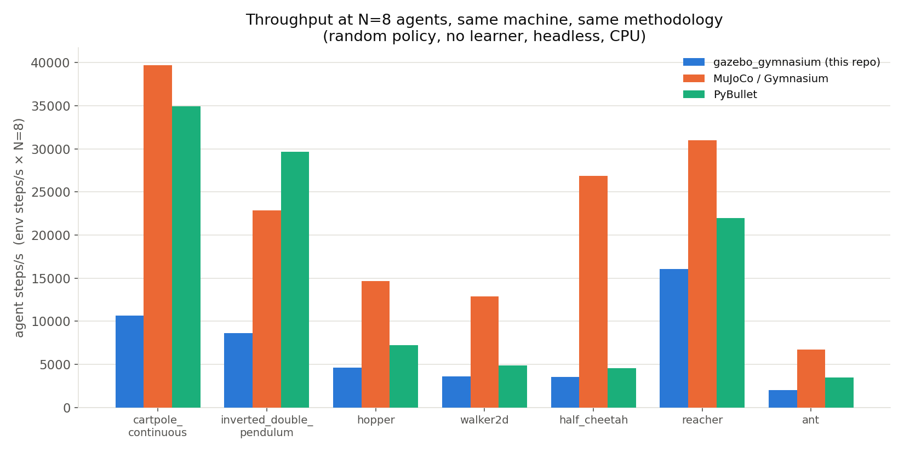
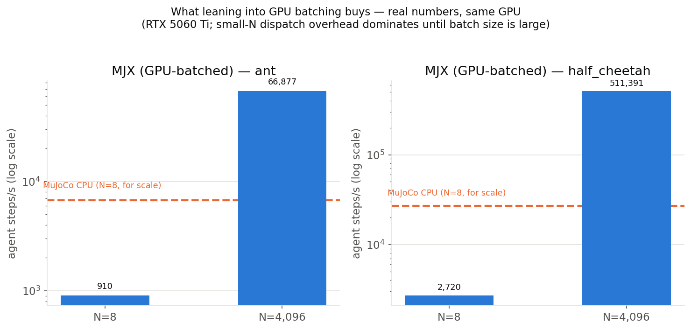

# How Gazebo Gymnasium Compares

This document places the project relative to the other reinforcement-learning
simulation libraries people reach for, with real numbers where a real
number was obtainable on this machine, and cited claims where it was not.
It closes the `ROADMAP.md` item asking for a comparison run against
canonical MuJoCo.

## Summary

`gazebo_gymnasium`'s reason to exist is not raw throughput. A
general-purpose robotics simulator, Gazebo, with a full Entity Component
Manager (ECM), native Robot Operating System 2 (ROS 2) integration, and
physically modeled sensors, will never out-step a physics engine built
from scratch for reinforcement-learning research; it runs 1.9 to 7.7 times
slower than MuJoCo per environment step on this machine, detailed below,
and orders of magnitude behind GPU-batched physics at scale. What it
offers instead is real ROS 2 Jazzy and Gazebo Harmonic integration, launch
files, `ros_gz_bridge`, and actual camera and sensor rendering pipelines
rather than a physics-only stub, an architecture built around
N-agents-in-one-world from the ground up, and a real path from a policy
trained in simulation toward a policy running on a physical rover over the
same sensor and actuator boundary a real robot has. See
[`docs/examples/line_follower.md`](examples/line_follower.md): the
simulated task is solved and domain-randomization tuned, while the
physical translation layer and hardware trial live in a separate,
rover-specific project outside this repository and have not run yet, so
this counts as "ready to deploy," not "deployed." Choosing MuJoCo makes
sense for maximum steps per second on canonical MuJoCo benchmarks;
choosing this project makes sense for a robot that thinks it is running on
real ROS 2 hardware while it trains.

## Methodology

Measurements come from this machine directly (an AMD or Intel CPU paired
with an NVIDIA RTX 5060 Ti, 8 gigabytes of Video Random-Access Memory
(VRAM), driver 595.71.05, CUDA 13.2). `gazebo_gymnasium` measured itself
through `training_scripts/benchmark.py`; MuJoCo, PyBullet, and MuJoCo XLA
(MJX) measured through an isolated virtual environment (`pip install
"gymnasium[mujoco]" pybullet pybullet_envs_gymnasium jax[cuda12]
mujoco-mjx`), kept outside `pixi.lock` so it never touches the project's
pinned environment. All four measure the same thing the same way: a
random policy, no learner, headless, N vectorized environments in one
process, 20 warmup steps discarded, 300 timed steps, reporting environment
steps per second (one vectorized step, all N agents) and agent steps per
second (environment steps per second times N, the number comparable to a
single-agent simulator). Every measurement shares the same random-uniform
action sampling and the same seed.

Isaac Lab and Brax's Tensor Processing Unit (TPU) numbers were cited, not
run here. Isaac Lab needs an Isaac Sim install, an Omniverse-based
download of tens of gigabytes with a support matrix that likely does not
yet cover this GPU's generation, and no TPU exists on this machine for
Brax's numbers. Both figures come from the projects' own published claims,
sourced below, and should be read as directional rather than verified
under this document's methodology.

The exact commands to regenerate the raw CSVs directly appear under
"Reproducing This" at the bottom; the numbers below come straight from
that output, not rounded further.

## Throughput Against MuJoCo And PyBullet



| Environment | gazebo_gymnasium | MuJoCo/Gymnasium | PyBullet |
|---|---:|---:|---:|
| cartpole_continuous | 10,628 | 39,734 | 34,951 |
| inverted_double_pendulum | 8,654 | 22,845 | 29,683 |
| hopper | 4,647 | 14,678 | 7,241 |
| walker2d | 3,630 | 12,903 | 4,871 |
| half_cheetah | 3,512 | 26,855 | 4,533 |
| reacher | 16,084 | 30,992 | 21,976 |
| ant | 2,029 | 6,695 | 3,487 |

(Agent steps per second, N=8, random policy, headless, this machine.)

MuJoCo wins every row, usually by 1.9 to 7.7 times, and PyBullet lands
between the two on most environments. None of this counts as a problem to
fix, since MuJoCo runs a minimal C physics kernel purpose-built for
exactly this benchmark, while `gazebo_gymnasium` runs the full Gazebo and
DART stack underneath every step, a general ECM, a scene graph capable of
rendering, and a physics engine that also has to support being watched
live in a GUI. The interesting number is not the ratio itself but that it
stays a small, stable ratio, 1.9 to 7.7 times rather than 50 times: the
in-process backend, with `real_time_factor=0`, N-agents-in-one-world, and
no gz-transport in the loop, earns back most of what a general simulator
would otherwise cost.

`line_follower`, vision-based, an EGL-rendered camera, N=8, reaches 21.1
environment steps per second, not shown on the chart above. Rendering a
real camera frame every tick sits in a different regime than joint-state
physics, and neither MuJoCo's default environments nor PyBullet's Bullet
ports in this comparison render pixels, so no apples-to-apples row exists
for it. It appears here for completeness, as the cost of the thing none of
the state-based comparisons above even attempt.

## What GPU-Batched Physics Buys



This is the number explaining Isaac Lab and Brax's whole pitch, run for
real on this machine through MJX (MuJoCo's JAX/GPU backend) against the
same `ant.xml` and `half_cheetah.xml` models used in the MuJoCo row above.

| | N=8 | N=4,096 |
|---|---:|---:|
| ant (agent steps/s) | 910 | 66,877 |
| half_cheetah (agent steps/s) | 2,720 | 511,391 |

At N=8, MJX runs slower than everything above it, since GPU
dispatch and kernel-launch overhead per Python-level step call has not
amortized yet, so a tiny batch pays pure latency tax. At N=4,096, the same
GPU running the same physics reaches roughly 10 to 19 times the total
agent steps per second of MuJoCo's CPU number at N=8 (73 to 188 times its
own N=8 number, though most of that gain reflects pure batch-size scaling
rather than GPU against CPU). Neither number means "the GPU is fast" or
"the GPU is slow" in isolation; GPU-batched physics is a different scaling
regime that only pays off once thousands of parallel environments are
committed to, exactly the regime Isaac Lab and Brax are built around and
none of `gazebo_gymnasium`, MuJoCo's default vectorization, or PyBullet
are.

`gazebo_gymnasium`'s own N-agents-in-one-world architecture aims at a
similar idea, sharing one world and context across N agents instead of N
separate processes, on the CPU, at a scale (8 to 32 agents) where a GPU is
not needed to pay off: a middle ground, not a competitor to the
GPU-batched approach at its own scale.

## Cited Numbers, Not Run Here

- **Isaac Lab** reports running 1,024 parallel environments with RGB-D
  sensors on a single RTX 4090 (24 gigabytes), with throughput scaling
  roughly linearly with VRAM as environment count grows, as part of
  NVIDIA's Isaac Sim and Omniverse stack.
  [developer.nvidia.com/isaac-lab](https://developer.nvidia.com/isaac-lab),
  [github.com/isaac-sim/IsaacLab](https://github.com/isaac-sim/IsaacLab).
- **Brax** reports millions of physics steps per second on a single TPU or
  GPU for MuJoCo-style environments, Ant for example, scaling to hundreds
  of millions of steps per second across multiple TPUs. Google's own
  framing calls this "100 to 1000 times faster reinforcement-learning
  training," achieved by keeping physics and the reinforcement-learning
  optimizer on the same accelerator.
  [github.com/google/brax](https://github.com/google/brax),
  [research.google/blog](https://research.google/blog/speeding-up-reinforcement-learning-with-a-new-physics-simulation-engine/).

Both numbers stay consistent with what MJX, a close architectural cousin,
also JAX-based and also GPU-batched MuJoCo, actually measured above at
large N, which is why they read as plausible rather than simply taken on
faith.

## Architecture And Feature Comparison

| | gazebo_gymnasium | MuJoCo/Gymnasium | PyBullet | Isaac Lab | Brax | gym-gazebo-sim | ros_gazebo_gym |
|---|---|---|---|---|---|---|---|
| Physics | Gazebo (DART), CPU | MuJoCo, CPU (MJX: GPU) | Bullet, CPU | PhysX, GPU-only | Custom, GPU/TPU-only | Gazebo (DART), CPU | Classic Gazebo (ODE), CPU |
| ROS integration | Native, ROS 2 Jazzy, launch files, `ros_gz_bridge` | None | None | Optional, secondary | None | Native, ROS 2 Jazzy | ROS 1 Noetic |
| Vectorized/multi-agent | Yes, N-agents-in-one-world, 3 backends | Yes (`gym.vector`) | Via wrappers | Yes, the whole point | Yes, the whole point | No, single-agent | No, single-agent |
| Real sensor rendering | Yes, EGL/ogre2 camera, real JPEG/exposure domain randomization | No camera model | Limited | Yes, RGB-D, extensive | No | Inherited from Gazebo, unexercised | No |
| Sim-to-real path | Simulation solved, deployment path fully specified, hardware trial not yet run | Not applicable, no ROS/robot target | Not applicable | Yes, NVIDIA's own focus | Not applicable | Stated goal, early-stage | Stated goal |
| GPU requirement | Optional, learner only | None | None | Required | Required | Optional | None |
| Setup | Single `pixi install`, one Python environment | `pip install` | `pip install` | Isaac Sim install, tens of gigabytes | `pip install`, needs JAX and an accelerator | Standard ROS 2 workspace | ROS 1 workspace |
| Maturity/ecosystem | New, this repository | Huge, the field standard | Large, established | NVIDIA-backed, fast-growing | Google-backed | New (2026), educational | Established, ROS 1-era |
| Built-in environments | 9 (CartPole x2, InvertedDoublePendulum, Hopper, Walker2d, HalfCheetah, Reacher, Ant, LineFollower) | Roughly 15 canonical MuJoCo | Roughly 10 Bullet ports | Dozens, task-suite-driven | Dozens | Task-specific, course-driven | Task-specific |

## RL Library Integration

Isaac Lab's own headline feature list reads "works with skrl, rsl_rl,
rl_games, and SB3." All four are real and tested here too, trained end to
end against the actual engine on `cartpole_continuous`, not stand-ins. The
full writeup, code, real gotchas found while building each one, and the
actual reward, loss, and timing curves live in
[`docs/rl_libraries.md`](rl_libraries.md).

| Library | Status | Summary |
|---|---|---|
| **Stable-Baselines3** | Done, solved | 500.0 out of 500, swept, 4 of 4 perfect trials, this project's baseline |
| **skrl** | Trained, zero adapter code | 484.4 out of 500; `gymnasium.make_vec(...)` is already what `wrap_env()` auto-detects. A real bug was found: `memory_size` must exactly equal `PPO_CFG().rollouts`, or PPO reads uninitialized memory, producing NaN actions. |
| **rl_games** | Trained, small custom `IVecEnv` | 458.0 out of 500. Three real gotchas surfaced while running it: dict-wrapped observations, legacy (not `gymnasium`) space types, and `num_actors`/`get_number_of_agents()` meaning independent episode-boundary groups, not batch size. |
| **rsl_rl** | Trained, a real adapter (`TensorDict`/torch-native) | 382.3 out of 500. Needs an explicit `distribution_cfg` on the actor model, or it builds no stochastic head at all, and `act()` crashes on the first call. |

Wall-clock time for the same 250,000-step run also got measured: SB3,
rl_games, and rsl_rl landed within a tight 43 to 50 second band, but skrl
took 714 seconds, roughly 15 times longer, same machine, same task. That
is a real result, not a typo; see `docs/rl_libraries.md` for the honest
caveat on what that number does and does not mean.

## Feature Checklist

This is the kind of list these projects' own documentation leads with. One
framing note matters before reading it: MuJoCo, PyBullet, and Brax are
bare simulators or physics engines with no bundled training scripts at
all, so Weights and Biases integration, checkpointing, and sweep tooling
are the concern of whatever sits on top, SB3, CleanRL, or rl_games, not
the simulator itself. Isaac Lab bundles a full training framework,
rl_games, rsl_rl, and skrl integrations, the way this repository's
`training_scripts/` does, so that comparison is the fair like-for-like one
on the training-tooling rows; marking MuJoCo, PyBullet, or Brax with a
cross there would compare them against a job they were never built to do,
so those cells read as not applicable instead.

| Feature | gazebo_gymnasium | MuJoCo/Gymnasium | PyBullet | Isaac Lab | Brax |
|---|:---:|:---:|:---:|:---:|:---:|
| Parallel/vectorized environments | Yes | Yes | Yes | Yes | Yes |
| GPU-accelerated physics | No, DART has no GPU engine | No (MJX does, separately) | No | Yes | Yes |
| GPU-accelerated learner | Yes (`GAZEBO_GYM_DEVICE=cuda`, verified working) | Not applicable, SB3/user's choice | Not applicable | Yes | Yes |
| Domain randomization | Yes, mass, actuator gain, and visual (brightness, noise, JPEG), population-based | Not applicable | Not applicable | Yes, a dedicated event/randomization manager | Partial, write your own |
| True multi-agent (Multi-Agent Reinforcement Learning, or MARL) | No, N copies of one specification, agents cannot observe or affect each other | Not applicable | Not applicable | Yes, explicit support | Partial, possible but not a first-class API |
| Camera/vision sensors | Yes, a real EGL/ogre2 render, one environment | No camera model | Partial, limited | Yes, RGB/depth/segmentation | No |
| IMU, contact, or ray-cast sensors | No, not exposed anywhere in `AgentSpec` | Not applicable | Partial, raw API, do it yourself | Yes | No |
| Real ROS 2 integration | Yes, native, launch files, `ros_gz_bridge` | No | No | Partial, optional/secondary | No |
| TensorBoard logging | Yes, `train.py --tensorboard` | Not applicable | Not applicable | Yes | Yes |
| Weights and Biases | Yes, `train.py --wandb` and `sweep.py --wandb` | Not applicable | Not applicable | Yes | Partial, through the user's own trainer |
| Hugging Face Hub push/pull | Partial, done manually so far, no `--push-to-hub` command-line flag yet, see `ROADMAP.md` | Not applicable | Not applicable | No | No |
| Video/replay recording | No, not wired | Yes (`gymnasium.wrappers.RecordVideo`) | Partial, basic | Yes | Partial |
| Checkpointing | Yes | Not applicable | Not applicable | Yes | Partial |
| Hyperparameter sweep tooling | Yes, `sweep.py`, seeded, subprocess-isolated | Not applicable | Not applicable | Yes | Partial |
| Throughput benchmark suite | Yes, `benchmark.py` | Not applicable | Not applicable | Yes | Yes |
| Procedural terrain generation | No | Not applicable | Not applicable | Yes | Partial |
| Config composition (Hydra/YAML) | No, argparse only | Not applicable | Not applicable | Yes (Hydra) | Partial |
| Continuous integration (build and test on every push) | Yes, GitHub Actions, nightly and on demand | Not applicable | Not applicable | Yes | Yes |

**The real gaps, ranked by how hard they would be to close.** TensorBoard
and Weights and Biases integration, the one genuinely cheap item, is
already done: `train.py --tensorboard` and `--wandb`. Closing it also
surfaced a real, pre-existing bug: `train.py` never wrapped the
environment with `VecMonitor`, so `rollout/ep_rew_mean`, the actual
reward-over-training curve, never populated anywhere, logger or no
logger. That got fixed alongside it; see `ROADMAP.md`.

1. **Real work, but bounded.** An actual `--push-to-hub`/`--from-hub`
   command-line flag (the manual process is proven, this project's own
   rover work did it by hand, it simply is not wrapped as a repeatable
   feature yet) and video recording (which blocks the Hugging Face
   replay-video story per `ROADMAP.md`).
2. **Architecturally hard, not a quick add.** GPU-accelerated physics
   would mean swapping DART for something else entirely; this project's
   identity, real Gazebo, real ROS 2, real sensor rendering, sits
   arguably incompatible with the physics-only, no-rendering-needed
   engines that get GPU physics, MuJoCo/MJX, PhysX, and Brax's own among
   them. True multi-agent interaction needs `reward_fn` and
   `terminated_fn` to see the whole batch, not just one agent's row, a
   real API change, not a bug fix; see `ROADMAP.md`'s framework-expansion
   notes.
3. **Probably not worth chasing for this project's actual mission.**
   Procedural terrain and Hydra-style config composition matter most for
   Isaac-Lab-scale locomotion research across huge task suites, a lower
   priority than the sim-to-real story this repository is actually built
   around. IMU, contact, and ray-cast sensors form a real, honest gap
   against Isaac Lab's sensor suite, but `line_follower`'s own
   documentation already notes the physical rover carries no IMU, so
   closing this gap would not currently unlock anything the real hardware
   could use.

`gym-gazebo-sim` deserves a specific callout: it is the closest sibling
project architecturally, sharing the same ROS 2 Jazzy and Gazebo Harmonic
target, but per its own announcement it stays single-agent, explicitly
aimed at low-performance computers for an undergraduate course, not a
vectorized or multi-agent design, a different point on the tradeoff curve
rather than a real competing choice for the same job.

## Where This Leaves Gazebo Gymnasium

Choosing this project makes sense when a trained policy eventually needs
to run against ROS 2 topics or services on real hardware, when camera or
sensor observations need to come from an actual rendered scene rather
than a physics-only stub, or when a project already builds on Gazebo and
does not want a second simulator in the stack just for reinforcement
learning. The `line_follower` sim-to-real work is the concrete case none
of this stays hypothetical for: the simulation side is solved, the
deployment path is fully specified, and only the physical hardware trial
itself remains ahead, not behind.

Choosing something else makes sense when the goal is simply beating a
MuJoCo benchmark number, or when a GPU-batching workload, thousands of
parallel environments, is the plan from day one; MuJoCo, MJX, Isaac Lab,
and Brax will all beat this project on raw throughput, often by an order
of magnitude or more, because that is what they are built for and this
project is not.

## Reproducing This

```bash
# gazebo_gymnasium's own numbers.
pixi run bash -c "source install/setup.sh && python training_scripts/benchmark.py --csv out.csv"

# MuJoCo, PyBullet, and MJX, in an isolated venv (does not touch pixi.lock).
python3 -m venv /tmp/compare_venv && source /tmp/compare_venv/bin/activate
pip install "gymnasium[mujoco]" pybullet pybullet_envs_gymnasium
# jax[cuda12] mujoco-mjx installs additionally, given an NVIDIA GPU.
```

## Glossary

| Term | Definition |
|---|---|
| **Entity Component Manager (ECM)** | Gazebo's runtime interface for reading and writing simulated joint and link state |
| **Robot Operating System 2 (ROS 2)** | The middleware this project integrates with natively, unlike most compared simulators |
| **Video Random-Access Memory (VRAM)** | The dedicated memory on a GPU, a limiting factor for parallel environment count |
| **Tensor Processing Unit (TPU)** | Google's accelerator hardware, relevant to Brax's cited throughput numbers |
| **MuJoCo XLA (MJX)** | MuJoCo's JAX-based, GPU-batched physics backend |
| **Multi-Agent Reinforcement Learning (MARL)** | Agents that observe or affect each other's state, not yet supported here |
| **Inertial Measurement Unit (IMU)** | A sensor reporting orientation and acceleration, absent from this project's physical rover |
