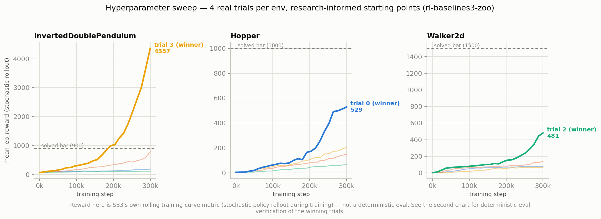
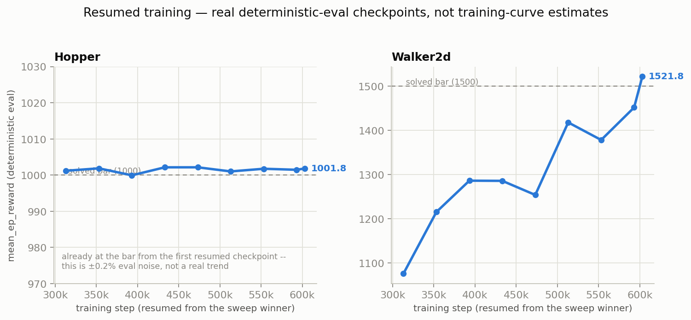
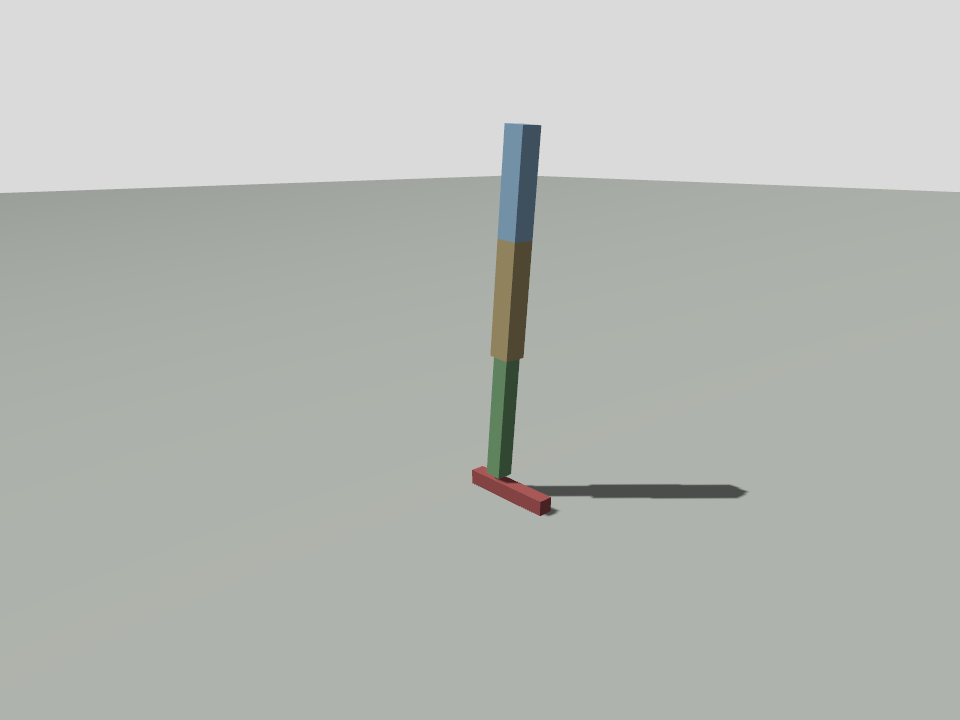
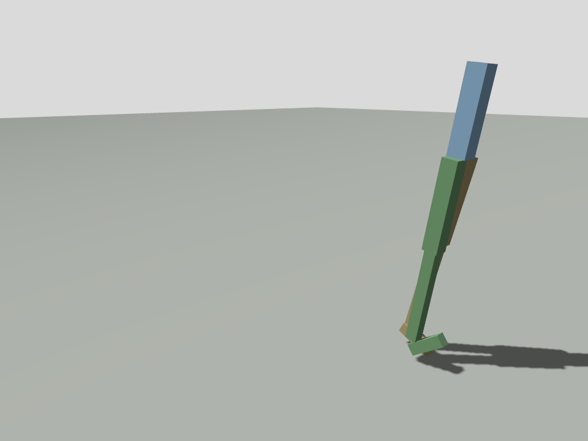

# Examples

Every environment in this library reduces to one `AgentSpec`: model,
observation, action, reward, and termination together. The framework runs
N copies of a specification in a single Gazebo world as a
Stable-Baselines3 `VecEnv`, so there is no per-environment Python class,
and "MultiCartPole," "MultiAnt," and the rest are just named
specifications. Adding a new one follows
[Creating Your Own Agent](../creating_your_own_agent.md).

```python
from gazebo_gymnasium_bridge.envs import make_inprocess

vec_env = make_inprocess("hopper", n_agents=16)   # one simulation, no launch needed
```

## Status

| Example | Spaces | Backends | Status |
|---------|--------|----------|--------|
| [CartPole](cartpole.md) | `Discrete(2)` / `Box(4,)` | in-process and harness | Verified, force-controlled, PPO solves to the 500 cap |
| [CartPole, continuous](cartpole.md#continuous-variant) | `Box(1,)` / `Box(4,)` | in-process and harness | Verified, PPO solves to the 500 cap (swept, 4 of 4 perfect trials); also the SAC and TD3 entry point |
| [InvertedDoublePendulum](inverted_double_pendulum.md) | `Box(1,)` / `Box(6,)` | in-process and harness | Solved, PPO 4357 episode reward, every evaluation episode hits the 1000-step cap |
| [Hopper](hopper.md) | `Box(3,)` / `Box(11,)` | in-process and harness | Solved, PPO 1002 episode reward, 999 of 1000 steps across 10 of 10 real evaluation episodes; [annotated porting tutorial](porting_hopper.md) available |
| [Walker2d](walker2d.md) | `Box(6,)` / `Box(17,)` | in-process and harness | Solved, PPO 1523 episode reward, 999 of 1000 steps across 10 of 10 real evaluation episodes |
| [HalfCheetah](half_cheetah.md) | `Box(6,)` / `Box(17,)` | in-process and harness | Verified, PPO runs at roughly 3.01 meters per second sustained (median 3.25, reward 0 to 1503) |
| [Reacher](reacher.md) | `Box(2,)` / `Box(6,)` | in-process and harness | Working, goal-as-joints target, dense distance reward |
| Pusher | Continuous | Not yet built | Planned, the same goal-as-joints trick, next in line |
| [Ant](ant.md) | `Box(8,)` / `Box(27,)` | in-process and harness | Mechanics verified (free-base observation, 100 percent survival); PPO and SAC both converge to a stand-still local optimum, a reward-shaping issue involving `alive_bonus`, not an algorithm-choice one, and not yet walking |
| Humanoid | Continuous | Not yet built | Planned, the same free-base recipe as Ant, not yet specified |
| Swimmer | Continuous | Not portable | Not portable faithfully, since it swims through MuJoCo's viscous fluid medium and DART has no fluid drag |
| [Line follower](line_follower.md) | `Box(2,)` wheels / `Box(64,64,3)` camera | in-process and harness | Verified, PPO solves to the 300-step cap, domain-randomization tuned for sim-to-real |
| [Rover line](rover_line.md) | `Box(2,)` speed+turn / `Box(10,)` line features | in-process | Verified, PPO drives 3.2 laps at the 600-step cap (100 percent), and holds zero-shot under domain randomization; the sim-to-real target |

## Solved Bars Explained

A verified status above means learnability is confirmed: a clean training
curve from the random baseline, under real physics, headless. Solved is a
stricter, per-environment bar.

| Environment | Solved Bar | Best Verified Result |
|---|---|---|
| CartPole, both variants | Mean episode reward at the 500-step cap | **500.0, solved** (discrete: swept, 3 perfect trials; continuous: swept, 4 of 4 perfect trials) |
| InvertedDoublePendulum | Mean episode length at the 1000-step cap | **1019 of 1000 steps, 4357 reward at 300,000 steps, solved.** Real published PPO hyperparameters, rl-baselines3-zoo's `InvertedDoublePendulum-v2` configuration, seeded the sweep's own trial 0 and found the winning region; the actual winner was a hand-picked variation around it, not the zoo configuration verbatim. Verified across 10 of 10 real evaluation episodes at the cap. |
| Hopper | 1000-step cap, reward at or above 1000 | **1002.2 reward, 999 of 1000 steps (10 of 10 real evaluation episodes) at 600,000 steps, solved.** Real published PPO hyperparameters (rl-baselines3-zoo's `Hopper-v4` configuration, used verbatim as the sweep's winning trial 0) reached 533 at 300,000 steps, still climbing steeply, not plateaued; `train.py`'s resume-from-checkpoint feature carried the same configuration to 600,000 steps and crossed the bar. |
| Walker2d | 1000-step cap, reward at or above 1500 | **1522.9 reward, 999 of 1000 steps (10 of 10 real evaluation episodes) at 600,000 steps, solved.** The zoo's own tuned configuration actually did poorly here (82.7 at 300,000 steps), but a hand-picked variation, a higher learning rate, fewer epochs, and no entropy bonus, reached 485.5 at 300,000 steps, still climbing steeply; the resume-from-checkpoint feature carried it to 600,000 steps and crossed the bar. |
| HalfCheetah | Open-ended, reporting sustained meters per second (MuJoCo-solved is roughly 5 to 6 meters per second) | Roughly 3.01 meters per second sustained (median 3.25) at 600,000 steps, up from 1.46 meters per second. Real published PPO hyperparameters (rl-baselines3-zoo's `HalfCheetah-v4`) found the winning region through `sweep.py --agent half_cheetah --algo ppo`; one hand-picked variation around the zoo's own tuned configuration won (`lr=3e-4, n_epochs=10` against the zoo's `lr=2e-5, n_epochs=20`, reaching 2.51 and 2.75 at 300,000 steps), then the resume-from-checkpoint feature carried the same winning configuration to 600,000 steps, since the curve was still climbing steeply, not plateaued. |
| Reacher | Mean episode reward at or above −5 (near the goal for most of the episode) | PPO reached −13 at 100,000 steps and **−10.4 at 200,000 steps** with real published hyperparameters (rl-baselines3-zoo's `Reacher-v2`). **SAC's −8.48 at 100,000 steps remains the best known result**: a fresh, properly tuned SAC sweep (rl-baselines3-zoo's own "mostly defaults" finding for SAC on real MuJoCo environments) did not beat it, reaching only −9.9 at best. |
| Ant | Open-ended, reporting sustained forward meters per second | 0.0 meters per second, confirmed under both PPO at 150,000 steps and a real SAC sweep at 300,000 steps (960.3 reward, but verified 0.00 meters per second sustained, mean absolute action 0.06, alive the whole episode; SAC found a more stable version of the exact same stand-still-and-collect-the-alive-bonus solution, not a walking gait). This rules out a PPO-specific exploration failure as the explanation: the reward shaping itself, `alive_bonus=1.0`, MuJoCo Ant-v4's own default, makes standing still a genuine local optimum independent of algorithm. Fixing this needs a reward change, lowering or removing the alive bonus or adding an explicit standing-still penalty, rather than a different algorithm; see `ROADMAP.md`. |
| Line follower | Mean episode length at the 300-step cap (never losing the line, meaning it takes every corner) | **300.0, solved** (swept PPO, 400,000 steps, domain-randomization tuned for sim-to-real); see [line_follower.md](line_follower.md). |
| Rover line | Completing a lap (9.31 meters of odometry-measured ground) inside the 600-step cap without losing the line | **30.06 meters, 3.2 laps, 16 of 16 episodes** (PPO, 200,000 steps, 4 agents), matching a classical proportional controller's 30.13 meters, against 1.64 meters for random actions. Holds 8 of 8 zero-shot under domain randomization. Distances are odometry, not commanded; see [rover_line.md](rover_line.md). |

InvertedDoublePendulum, Hopper, and Walker2d closed with real,
research-informed sweeps, rl-baselines3-zoo's own tuned hyperparameters as
a starting point, plus extended training, not architecture changes.
HalfCheetah and Reacher received the same treatment and real progress,
without yet crossing the bar. Ant remains the one genuine open problem:
both PPO and SAC converge to the same stand-still local optimum, pointing
at the reward function's `alive_bonus` term rather than the algorithm or
the sweep budget.



Hopper's and Walker2d's winning sweep configurations were still climbing
steeply at their 300,000-step cutoff, so `train.py`'s existing
resume-from-checkpoint feature carried them to 600,000 steps total on the
same hyperparameters, with no re-searching needed, verified against real
deterministic evaluations at each checkpoint rather than the training
curve's own stochastic-rollout estimate.



Hopper's panel stays flat by design, not from a charting bug: its winning
checkpoint had already reached the solved bar the moment the resume
started, 1001.8 at step 313,000 against 1002.2 at step 600,000, so the
sweep's own "533 at 300,000 steps" figure undersold it, since that number
reflects SB3's rolling training-curve metric, reward from stochastic
policy rollouts collected during training, rather than a clean
deterministic evaluation of that exact checkpoint. Walker2d's climb stays
real and continuous on the same deterministic-evaluation metric
throughout.

### What Solved Policies Look Like

Real captures, not mockups. A spectator camera added to the same
in-process world, with physics and actuation left untouched, rendered
these mid-rollout, at the exact control cadence, `frame_skip`, each policy
trained at.

| InvertedDoublePendulum | Hopper | Walker2d |
|---|---|---|
|  |  |  |

Hopper's pose is real, not a capture-timing accident, as the "Hopper's
panel stays flat" note above explains: its solved policy stays almost
perfectly stationary, and this is genuinely what 1002.2 reward looks like
for this specification. `forward_progress_reward` defaults to
`alive_bonus=1.0`, and Hopper's roughly 1.0-per-step average reward is
mostly that bonus, not forward velocity, the same reward-shaping effect
behind Ant's stand-still local optimum, just far less extreme, since
Hopper cannot stay upright at all without some real balancing correction,
unlike Ant's stable static stance. Walker2d's own reward stays large
enough, at least 1500 over 1000 steps, more than the alive bonus alone can
supply, that its policy had to learn a real forward gait instead, visible
directly in the capture.

The three not-yet-built rows above, pusher, ant, and humanoid, still carry
only visualization assets and no `AgentSpec` yet. Porting one is the
exercise the
[create-your-own-agent guide](../creating_your_own_agent.md) covers, and
[Porting Hopper, annotated](porting_hopper.md) narrates in full.

## Shared Architecture

Five pieces make up every specification.

1. **The model SDF**, the robot geometry, in
   [`resources/models/`](../../gazebo_gymnasium_examples/gazebo_gymnasium_resources/models/).
   For the harness backend it carries geometry only, with no controllers
   and no effort limit on actuated joints.
2. **The world and in-sim plugin**, a world SDF in
   [`resources/worlds/`](../../gazebo_gymnasium_examples/gazebo_gymnasium_resources/worlds/)
   that loads exactly one world-level plugin, either `MultiAgentHarness`
   or the per-agent controller. That plugin is the only Python running
   inside `gz sim`; it applies actions and reads sensors through the
   Entity Component Manager (ECM), with no training logic living inside
   the simulator.
3. **The `AgentSpec`**, in
   [`envs/agent_spec.py`](../../gazebo_gymnasium_bridge/gazebo_gymnasium_bridge/envs/agent_spec.py).
   Pure Python, with no `gz.*` import, unit-testable offline.
4. **The `VecEnv`**, returned by `make_multi` and `make_harness` as a
   standard SB3 `VecEnv`. Any Gymnasium-speaking library, SB3, RLlib,
   CleanRL, or a custom loop, drives it unchanged.
5. **The training script**,
   [`training_scripts/train.py`](../../training_scripts/train.py), and
   `deploy.py` alongside it, parameterized by `--agent`, `--n_agents`, and
   `--backend`.

## Training And Deploying

The default path needs no launch, since the in-process backend hosts the
simulator in the training process.

```bash
pixi run train  --agent cartpole --n_agents 16 --timesteps 200000
pixi run deploy --agent cartpole --n_agents 16
```

That combination stays the fastest option, and the one to use for
training and continuous integration. Two other backends exist for when a
launched simulator worth watching matters more.

| `--backend` | Simulation Location | Launch Needed? | Use It For |
|---|---|---|---|
| `inprocess` (default) | Training process | No | Training and continuous integration, fastest |
| `harness` | Launched `gz sim` | Yes | Watching a live or GUI simulation, O(1) transport, in-place reset |
| `peragent` | Launched `gz sim` | Yes | Small-N quick starts |

Using a launched backend means starting the simulator in one terminal and
training or deploying against it in another.

```bash
# Terminal 1 runs the simulator (with a GUI; headless:=true for none).
ros2 launch gazebo_gymnasium_bringup cartpole_harness.launch.py n_agents:=4 headless:=false

# Terminal 2 drives it.
pixi run deploy --agent cartpole --n_agents 4 --backend harness
```

`train.py` scales the transport timeouts with `n_agents` automatically and
prints an `[EpisodeSummary]` line at each group auto-reset.

## Background Documentation

Five deeper-dive documents cover surrounding context.

- [`gymnasium_api_reference.md`](../gymnasium_api_reference.md) covers the
  Gymnasium API surface, useful when porting environments from other
  simulators.
- [`sb3_api_reference.md`](../sb3_api_reference.md) covers what SB3 does
  to an environment, Monitor wrapping and VecEnv auto-reset among them;
  reading it before debugging SB3-specific behavior helps.
- [`verbose_sb3_coexistence.md`](../verbose_sb3_coexistence.md) covers how
  per-step logging interacts with SB3's verbose table.
- [`reviewing_data.md`](../reviewing_data.md) covers TensorBoard, the
  Hugging Face Hub, and watching a live simulation through Foxglove or
  PlotJuggler over gz-transport.
- [`importing_cad_models.md`](../importing_cad_models.md) covers
  exporting a URDF from CAD software and converting it to SDF, the path
  this project's own rover model took.
