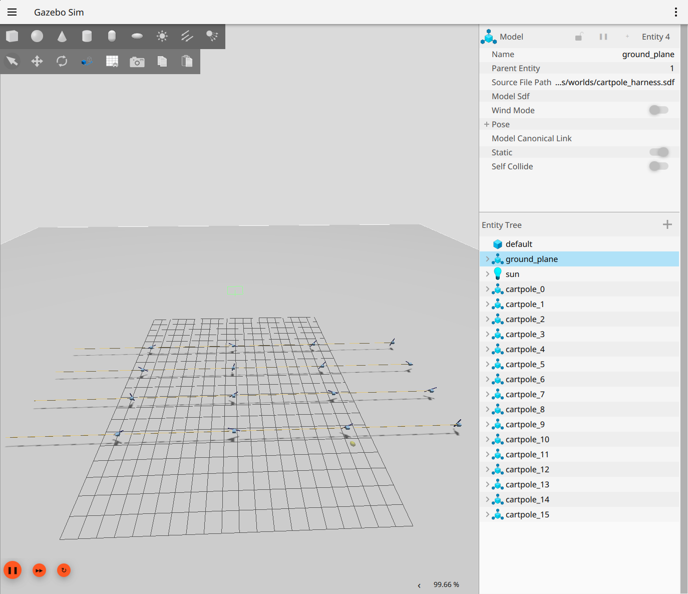

# CartPole

Classic CartPole, reproduced in Gazebo Harmonic, is the reference example
for the whole library. A cart slides along a rail on the Y axis,
and a pole hinged on top rotates around the X axis. The agent pushes the
cart with a force, the textbook CartPole actuation, to keep the pole
upright. Reading this alongside
[Creating Your Own Agent](../creating_your_own_agent.md) helps when adding
a new agent.

- **Observation.** `Box(4,)`: `[cart_pos, cart_vel, pole_angle, pole_ang_vel]`.
- **Action.** `Discrete(2)`, pushing the cart negative or positive along
  the rail at plus or minus 10 Newtons.
- **Reward.** `+1` per step alive.
- **Termination.** `|pole_angle| > 0.209` radians, or `|cart_pos| > 2.4`
  meters.



## How It Is Built

Everything runs through one `AgentSpec`, `_cartpole_spec()` in
[`envs/agent_spec.py`](../../gazebo_gymnasium_bridge/gazebo_gymnasium_bridge/envs/agent_spec.py).
The framework runs N copies of it in a single Gazebo world as an SB3
`VecEnv`, with no per-environment Python class needed.

```python
from gazebo_gymnasium_bridge.envs import make_multi, make_harness

vec_env = make_multi("cartpole",  n_agents=16)   # the per-agent backend
vec_env = make_harness("cartpole", n_agents=16)  # the batched-harness backend
```

Two backends drive the same specification, detailed further in
[the backend table](../creating_your_own_agent.md#the-three-backends).

- **Per-agent (legacy)** runs a world-level controller plugin, 2 topics
  per agent, resetting by re-spawning each model. The model lives at
  [`models/cartpole`](../../gazebo_gymnasium_examples/gazebo_gymnasium_resources/models/cartpole).
  Its `JointController` runs on velocity, so its dynamics differ from the
  force-based specification the Entity Component Manager (ECM) backends
  use, and policies do not transfer to it.
- **Harness** runs one `MultiAgentHarness` plugin, 3 topics total, O(1) in
  N, and resets in place through the ECM, avoiding both a respawn race and
  unclean per-agent pole randomization. The bare model lives at
  [`models/cartpole_bare`](../../gazebo_gymnasium_examples/gazebo_gymnasium_resources/models/cartpole_bare).

## Difficulty

The cart runs on bang-bang force control (`_CART_FORCE`, plus or minus 10
Newtons), the classic and genuinely unstable CartPole dynamics: a constant
push tips the pole in roughly 3 steps, and a random policy survives only
around 7 steps (median 6), while a trained Proximal Policy Optimization
(PPO) policy reaches the 500-step cap.

One physical subtlety is worth knowing. The model spawns clear of the
ground plane, at `spawn_z = 0.6`. A cart whose collision box rests on the
ground gets pinned by contact friction, which velocity control silently
overrides as a kinematic constraint but force control cannot, and this
masked force actuation entirely until it was diagnosed. Any new
force-actuated agent should stay off the floor for the same reason.

## Continuous Variant

`cartpole_continuous` uses the same model and dynamics, mapped instead
through a `Box(-1, 1)` action proportional to slider force (plus or minus
10 Newtons), the analog of Gymnasium's MuJoCo InvertedPendulum and the
entry point for continuous-control algorithms such as Soft Actor-Critic
(SAC), Twin Delayed Deep Deterministic policy gradient (TD3), and Deep
Deterministic Policy Gradient (DDPG).

```python
from gazebo_gymnasium_bridge.envs import make_inprocess

env = make_inprocess("cartpole_continuous", n_agents=8)   # an SB3 VecEnv

import gymnasium as gym
env = gym.make("GazeboCartPoleContinuous-v0")             # a standard gym.Env
```

PPO solved this variant through a swept run
(`training_scripts/sweep.py --agent cartpole_continuous --algo ppo
--n-agents 16 --timesteps 250000`): all 4 of 4 configurations hit 500.0
out of 500, showing the same dynamics transfer cleanly from discrete
CartPole with no configuration-specific tuning needed. The checkpoint
lives at `models/cartpole_continuous_ppo_sweep_best.zip`.

SAC and TD3 were also verified, against a random baseline of 7.6 out of
500 for reference. SAC reaches 476.2 out of 500 at 200,000 steps, close
but not swept to the exact cap, while TD3 shows a clear learning signal,
51.0 out of 500, though well short at 100,000 steps. TD3 needs either more
steps or tuning to close the gap; this environment is not a fundamental
blocker for it.

## Running It

The fastest path needs one command and no launch, since the in-process
backend hosts the simulator inside the training process.

```bash
python training_scripts/train.py --agent cartpole --n_agents 16
# Or sweep hyperparameters headlessly to solve it outright.
python training_scripts/sweep.py --n_agents 16 --timesteps 250000
```

Watching it in a launched simulation needs two terminals, with
`headless:=false` for a visible GUI.

```bash
# Terminal 1 starts the simulator.
ros2 launch gazebo_gymnasium_bringup cartpole_harness.launch.py n_agents:=16 headless:=true
# Terminal 2 trains against it.
python training_scripts/train.py --agent cartpole --n_agents 16 --backend harness
```

The pixi shortcuts cover the same workflow more briefly.

```bash
pixi run sim      # cartpole_multi.launch.py, with the GUI
pixi run train    # runs train.py against it
pixi run deploy   # rolls out a trained policy
```

### Launch Arguments

| Argument | Default | Effect |
|---|---|---|
| `n_agents` | `4` | Number of cartpoles spawned into the one world |
| `headless` | `true` | Setting this to `false` runs the Gazebo GUI, at a lower real-time factor, so fewer agents are recommended |

### Training Arguments

`train.py` accepts the following arguments.

| Argument | Default | Effect |
|---|---|---|
| `--agent` | `cartpole` | The registered specification name |
| `--n_agents` | `4` | Must match the launch; timeouts scale with this automatically |
| `--backend` | `peragent` | `peragent` or `harness`, and must match the launched world |
| `--algo` | `ppo` | `ppo` or `a2c`, for discrete actions |
| `--timesteps` | `200000` | Total environment steps |

## What Good Looks Like

Each group auto-reset prints an `[EpisodeSummary]` line. Mean episode
length climbs from a few steps toward the `max_episode_steps` cap of 500
as PPO learns to balance the pole. With the harness backend, no `Visual: …
already exists` warnings should appear, and poles should start upright
with small per-agent variation, confirming the in-place ECM reset is
working correctly.

## Deploying Published Models

Solved checkpoints for both variants are published to
[`CursedRock17/gazebo-gymnasium-policies`](https://huggingface.co/CursedRock17/gazebo-gymnasium-policies):
`cartpole` (PPO, 500.0 of 500, swept across 4 configurations) and
`cartpole_continuous` (SAC, 500.0 of 500). Running one needs no separate
download step:

```bash
pixi run deploy --agent cartpole --n_agents 4 \
    --from-hub CursedRock17/gazebo-gymnasium-policies \
    --hub-filename cartpole/model.zip
```

Swap `cartpole` for `cartpole_continuous` in both the `--agent` and
`--hub-filename` values for the continuous variant. Training a new run
and pushing it back up works the other direction:

```bash
pixi run train --agent cartpole --n_agents 16 --timesteps 250000 \
    --push-to-hub <your-username>/<your-repo>
```

`--push-to-hub` runs a real deterministic evaluation once training
finishes and uploads the model plus an auto-generated model card
documenting the algorithm, hyperparameters, and that evaluated result;
see [`docs/reviewing_data.md`](../reviewing_data.md#hugging-face-hub)
for the full mechanism, including the `huggingface_sb3` and Hub CLI
alternatives to `deploy.py --from-hub`.

## Bringing Your Own Trainer

Three interoperability surfaces all share one `AgentSpec`.

```python
# 1. Stable-Baselines3, through its own VecEnv API, the fastest path.
import stable_baselines3 as sb3
from stable_baselines3.common.vec_env import VecNormalize
from gazebo_gymnasium_bridge.envs import make_inprocess

vec = VecNormalize(make_inprocess("cartpole", n_agents=16))   # normalizes observations
sb3.PPO("MlpPolicy", vec, n_steps=64).learn(total_timesteps=1_000_000)

# 2. Any Gymnasium tool (RLlib, CleanRL, Tianshou, TorchRL), a standard env.
import gazebo_gymnasium_bridge          # registers the ids
import gymnasium as gym
env = gym.make("GazeboCartPole-v0")     # (obs, reward, terminated, truncated, info)

# 3. The efficient N-in-one simulation as a native gymnasium vector env.
vec = gym.make_vec("GazeboCartPole-v0", num_envs=16,
                   vectorization_mode="vector_entry_point")
```

The observation carries unbounded velocity components, so wrapping with
observation normalization, `VecNormalize` for SB3 or `NormalizeObservation`
and `NormalizeReward` for Gymnasium, matters before training with most
algorithms.

## Glossary

| Term | Definition |
|---|---|
| **Entity Component Manager (ECM)** | Gazebo's runtime interface for reading and writing simulated joint and link state |
| **Proximal Policy Optimization (PPO)** | The default reinforcement learning algorithm used across the framework's specifications |
| **Soft Actor-Critic (SAC)** | An off-policy algorithm suited to continuous action spaces, verified against this environment |
| **Deep Deterministic Policy Gradient (DDPG)** | An off-policy continuous-control algorithm, the base TD3 extends |
| **Twin Delayed Deep Deterministic Policy Gradient (TD3)** | An off-policy continuous-control algorithm, verified against this environment |
| **AgentSpec** | The dataclass describing one agent's model, observation, action, reward, and DR configuration |
