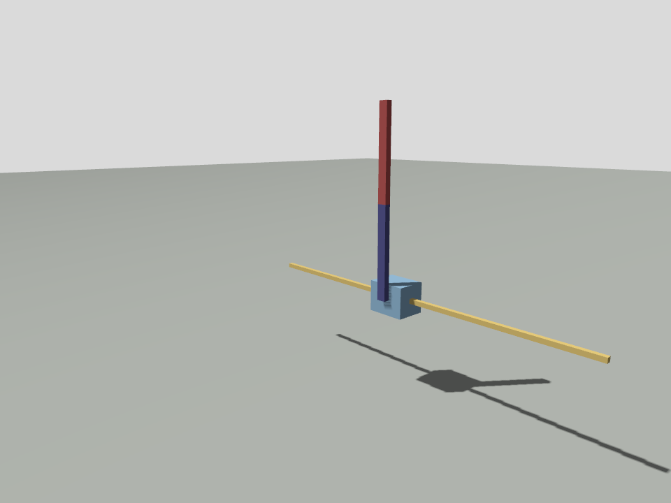

# InvertedDoublePendulum

<!-- TODO: expand this intro paragraph, one or two sentences on what
     InvertedDoublePendulum is and how it differs from CartPole. -->

## Overview

<!-- TODO -->

## Objective

<!-- TODO -->

## Observation Space

`Box(6,)`, `float32`, unbounded. `pole2_angle` is relative to pole 1, not
the world frame.

| Index | Name | Type | Min | Max |
|---|---|---|---|---|
| 0 | `cart_pos` | `float32` | −inf | inf |
| 1 | `cart_vel` | `float32` | −inf | inf |
| 2 | `pole1_angle` | `float32` | −inf | inf |
| 3 | `pole1_ang_vel` | `float32` | −inf | inf |
| 4 | `pole2_angle` (relative to pole 1) | `float32` | −inf | inf |
| 5 | `pole2_ang_vel` | `float32` | −inf | inf |

## Action Space

`Box(1,)`, `float32`, normalized to `[-1, 1]`. `proportional_forces` scales
that normalized value to the physical force range below.

| # | Action | Min | Max | Joint | Name | Type |
|---|---|---|---|---|---|---|
| 0 | Cart slider force | −100 N | 100 N | prismatic | `slider_to_cart` | `float32` |

## Installation

No per-example install step exists beyond the repository-wide setup in
[the root README](../../README.md#installation): `pixi install` resolves
ROS 2 Jazzy, Gazebo Harmonic, and the RL libraries into one environment,
and `pixi run build` builds the colcon workspace. Every registered
`AgentSpec`, this one included, is available the moment that build
finishes.

## Training

No launch file exists yet for this environment (only `cartpole` and
`line_follower` ship one today), so training runs exclusively through the
in-process backend, with no GUI to watch mid-training.

```bash
pixi run train --agent inverted_double_pendulum --n_agents 16 --timesteps 200000
```

<!-- TODO: once/if a harness launch file exists for this environment,
     document the launched + GUI workflow here, matching cartpole.md. -->

## Evaluation

```bash
pixi run deploy --agent inverted_double_pendulum --n_agents 4
```

<!-- TODO: expected episode length / reward at evaluation, once verified
     against a specific checkpoint. -->

## CLI Arguments

`deploy.py`'s Hugging Face Hub and agent-count flags:

| Argument | Default | Effect |
|---|---|---|
| `--agent` | `cartpole` | Registered spec name: pass `inverted_double_pendulum` |
| `--n_agents` | `4` | Number of agents evaluated in parallel |
| `--model` | `models/<agent>_multi/final_<algo>_n<N>.zip` | Local checkpoint path |
| `--from-hub` | `None` | Hugging Face Hub `repo_id` to download and run instead of `--model` |
| `--hub-filename` | `model.zip` | Filename within the Hub repo (only with `--from-hub`) |
| `--episodes` | `3` | Evaluation episodes |
| `--backend` | `inprocess` | `inprocess`, `harness`, or `peragent` |

## Deploying Published Models

A solved checkpoint (4357.3 reward, 10 of 10 evaluation episodes at the
1000-step cap) is published to
[`CursedRock17/gazebo-gymnasium-policies/inverted_double_pendulum`](https://huggingface.co/CursedRock17/gazebo-gymnasium-policies).
Running it needs no separate download step:

```bash
pixi run deploy --agent inverted_double_pendulum --n_agents 4 \
    --from-hub CursedRock17/gazebo-gymnasium-policies \
    --hub-filename inverted_double_pendulum/model.zip
```

Or pull it directly with the Hub CLI, or `huggingface_sb3` in Python:

```bash
hf download CursedRock17/gazebo-gymnasium-policies inverted_double_pendulum/model.zip --local-dir models/
```

```python
from huggingface_sb3 import load_from_hub

checkpoint = load_from_hub(
    repo_id="CursedRock17/gazebo-gymnasium-policies",
    filename="inverted_double_pendulum/model.zip",
)
```

## Screenshot



A real spectator-camera capture of a solved policy mid-rollout, not a
mockup; see [README.md](README.md#what-solved-policies-look-like).

## Reward Space

Shaped like MuJoCo's own InvertedDoublePendulum reward: an alive bonus
minus a tip-distance penalty and a velocity penalty, with coefficients
tuned to this model's scale.

```
tip_x, tip_h = forward_kinematics(pole1_angle, pole2_angle)  # 0.6 m poles
reward = 10.0 - 0.01 * tip_x**2 - 10.0 * (1.2 - tip_h)**2 - 0.001 * (pole1_ang_vel**2 + pole2_ang_vel**2)
```

**Termination.** The pole tip's height drops to or below 1.0 m.
`max_episode_steps=1000`.

## Glossary

| Term | Definition |
|---|---|
| **Entity Component Manager (ECM)** | Gazebo's runtime interface for reading and writing simulated joint and link state |
| **Proximal Policy Optimization (PPO)** | The default reinforcement learning algorithm used across the framework's specifications |
| **AgentSpec** | The dataclass describing one agent's model, observation, action, reward, and DR configuration |

## Difficulty

<!-- TODO: rate easy / medium / hard once a solve is verified and
     compared against the other environments' effort. -->

## Domain Randomization

Not implemented for this environment: `inverted_double_pendulum`'s
`AgentSpec` sets no domain-randomization fields. See
[`domain_randomization.md`](../domain_randomization.md) for the mechanism
`line_follower` uses, if this environment ever needs sim-to-real transfer.

## Training Arguments

`train.py`'s flags, shared across every registered agent.

| Argument | Default | Effect |
|---|---|---|
| `--agent` | `cartpole` | Registered spec name: pass `inverted_double_pendulum` |
| `--n_agents` | `4` | Agents in one sim (1 = single-agent) |
| `--algo` | `ppo` | `ppo`, `a2c`, `sac`, `td3`, or `ddpg`; this environment's `Box(1,)` action works with all five |
| `--timesteps` | `200000` | Total environment steps |
| `--backend` | `inprocess` | `inprocess`, `harness`, or `peragent` |
| `--tensorboard` | off | Log to `models/<agent>_multi/tb/` |
| `--wandb` | off | Also mirror the run to Weights & Biases (implies `--tensorboard`) |
| `--push-to-hub` | `None` | Upload the trained model + an auto-generated model card to this Hugging Face Hub `repo_id` |
| `--hub-eval-episodes` | `5` | Deterministic eval episodes used to fill in the model card (only with `--push-to-hub`) |

## What Good Results Look Like

<!-- TODO: fill in once a checkpoint is verified, see README.md's
     "Solved Bars Explained" table for the current InvertedDoublePendulum
     entry and images/mujoco_sweep_curves.png +
     images/mujoco_resume_verification.png for the existing training
     curves this environment already shares with Hopper and Walker2d. -->

## Trying It With Different Libraries

```python
# 1. Stable-Baselines3, through its own VecEnv API.
import stable_baselines3 as sb3
from gazebo_gymnasium_bridge.envs import make_inprocess

vec = make_inprocess("inverted_double_pendulum", n_agents=16)
sb3.PPO("MlpPolicy", vec, n_steps=64).learn(total_timesteps=1_000_000)

# 2. Any Gymnasium tool (RLlib, CleanRL, Tianshou, TorchRL), a standard env.
import gazebo_gymnasium_bridge
import gymnasium as gym
env = gym.make("GazeboInvertedDoublePendulum-v0")

# 3. The native gymnasium vector env.
vec = gym.make_vec("GazeboInvertedDoublePendulum-v0", num_envs=16,
                   vectorization_mode="vector_entry_point")
```

[`docs/rl_libraries.md`](../rl_libraries.md) covers skrl, rl_games, and
rsl_rl too, each through its own `training_scripts/train_<library>.py
--agent inverted_double_pendulum`, inside the `rl-libs` pixi environment.
Every registered Box-action agent works with those three scripts; the
library page's own tested run used `cartpole_continuous`.

## Version History

<!-- TODO -->
