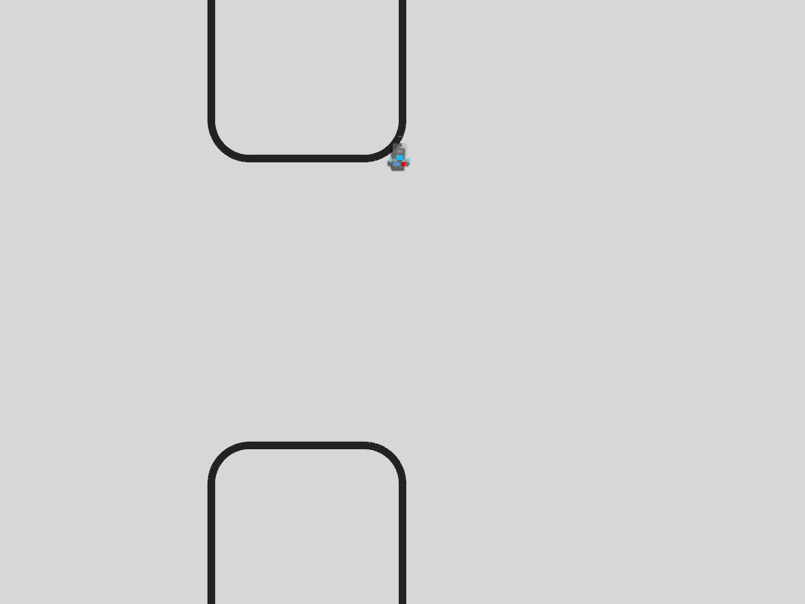
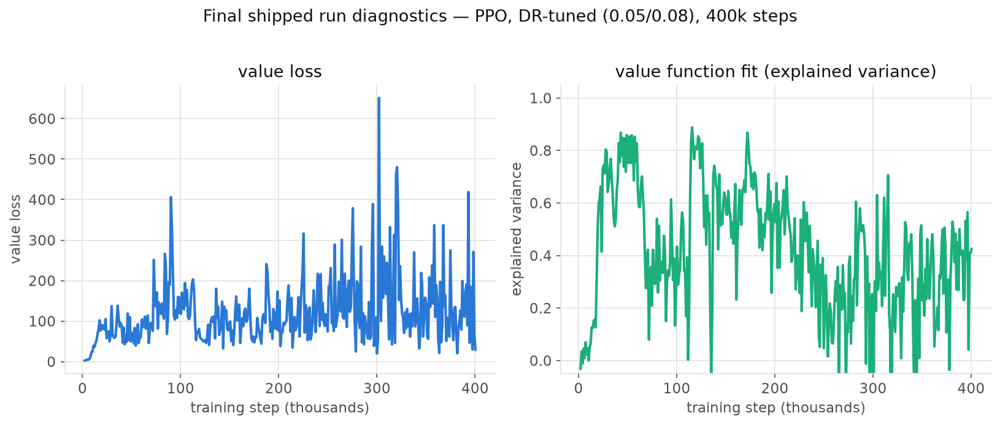
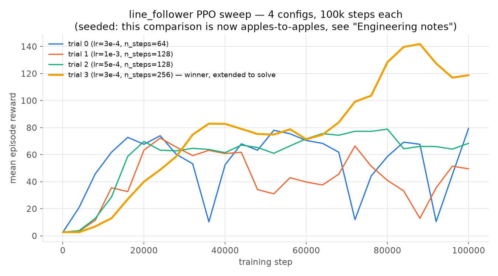

# Line Follower

Line Follower puts a camera-driven policy on a differential-drive rover and
asks it to drive a painted line around a closed track. The objective is to
finish any track it is dropped onto, as quickly as it can, while holding the
line under the middle of the chassis. Those three goals pull against each
other, so a run is judged on all of them at once: whether it finished, how
long it took, and how far off center it drifted getting there.

This is the one environment here that is meant to leave the simulator. The
same policy is intended to drive the physical rover the model was built
from, which makes `line_follower` this project's `sim2real` case: every
choice in the specification below is constrained by what the real rover can
actually sense and actually execute. That rover carries three sensors, an
onboard camera and one quadrature encoder per drive wheel, and accepts one
kind of command, a left and right wheel speed in meters per second.

> **Specification status, 2026-08-28.** This environment changed
> substantially over 2026-08-27/28 and every table below describes the CURRENT
> code. Rows are marked **shipped** or **planned**.
>
> **Every checkpoint published before 2026-08-28 is stale**, including the
> Hugging Face policy referenced under Solved Performance. Those were trained
> against a different action space, a different reward, a bare-image
> observation, a 300-step cap, and spherical wheel collisions. They still
> load, but they are not policies for this specification, and their solved
> numbers do not describe this task.
>
> The task is **not solved**. The best checkpoint covers 1.92 m of a ~10 m
> loop before losing the line at the first corner.

## Observation Space

The camera is the only sensor that can see the line, but a frame on its own
cannot tell the policy whether the wheels are actually turning, how fast
they are turning, or where in the frame the line currently sits. The
encoders answer the first two, and a centroid extracted from the frame
answers the third. All three are available on the real rover, computed on
the laptop from the same camera image and the same encoder replies the
firmware already returns on UDP port 9001.

| Component | Space | Status | Where it comes from | Why it is there |
|---|---|---|---|---|
| `image` | `Box(0, 255, (64, 64, 3), uint8)` | shipped | The onboard camera, `R8G8B8`, rendered at 30 Hz | The only channel that sees the track |
| `track[0:4]` | offsets, `[-1, 1]` | shipped | Lateral offset of the line in each of 4 horizontal scan bands, nearest first; `0.0` where that band sees nothing | One row gives position only; several give position AND angle, which is what lets a tracker see a corner coming |
| `track[4:8]` | flags, `[-1, 1]` | shipped | `1.0` where that band sees line, `-1.0` where it does not | Separates "line is centred" from "line is gone", which an offset alone cannot express |
| `track[8]` | heading, `[-1, 1]` | shipped | Line angle across the bands | The second term a Stanley controller adds to a pure lateral controller |
| `track[9]` | curvature, `[-1, 1]` | shipped | Second difference across the bands | How sharply the visible track bends; also gates the speed reward |
| Wheel speeds | `Box(-1.0, 1.0, (2,), float32)` | **planned** | Left and right encoder rate | Commanded speed is not achieved speed during the motor's ramp. Still not implemented |

The policy observation is therefore a `Dict` of `image` and `track`, trained
with SB3's `MultiInputPolicy`. `AgentSpec.observation_space` stays the bare
frame so `reward_fn`, `terminated_fn` and existing callers are unaffected;
`AgentSpec.policy_observation_space` is what the network sees.

Every `track` element is computed from the SAME frame the policy sees, DR
augmentation included, because on hardware these come off a compressed,
auto-exposed JPEG rather than off ground truth. None of it is privileged
simulator state.

Adding encoders reverses an earlier decision to keep them out, taken back
when the action mapped straight to a joint velocity setpoint that the
simulated joint met instantly, making the reading a near-tautological
readback of the policy's own action. That is no longer true on either side:
the real wheel ramps toward its setpoint under a PID loop, and
`action_gain_randomization` and `battery_discharge_randomization` already
put a gap between what was commanded and what was delivered in simulation.

Whatever the specification exposes, training wraps it before the network
sees it, so a loaded checkpoint reports different shapes than the table
above. How It Is Built covers the wrapping.

## Action Space

One `Box(-1.0, 1.0, (2,), float32)`, two normalized wheel velocities.

| Index | Status | Unnormalized meaning |
|---|---|---|
| `0` | shipped | Left wheel speed in meters per second, sent to the firmware as `left_mps` |
| `1` | shipped | Right wheel speed in meters per second, sent to the firmware as `right_mps` |

Two wheel speeds are exactly what the drive firmware's closed-loop `'m'`
command takes, so a rollout's action needs no kinematic conversion on the
way to the hardware.

Until 2026-08-27 the mapping scaled `[-1, 1]` linearly onto plus or minus
15 rad/s, which spent half the action range driving backwards and most of
the rest inside a band where a real wheel does not turn. `clamped_velocities`
replaced it with a forward-only affine map onto the band the rover can
execute:

```
v = V_MIN + (a + 1)/2 * (V_MAX - V_MIN)     V_MIN = 0.10 m/s, V_MAX = 0.51 m/s
```

so `a = -1` is the slowest the wheel will turn and `a = +1` is the fastest,
and no action anywhere in the space commands a stop or a reverse. Steering
still works, purely on the difference between the two wheels. Speed Range And
Motor Response below has the measured numbers behind `V_MIN` and `V_MAX`.

Two consequences worth stating plainly. The tightest reachable turn radius
is now `(wheel_sep/2) * (V_MAX + V_MIN) / (V_MAX - V_MIN)`, about 0.12 m, so
a sharp corner has to be driven as an arc rather than pivoted through. And
every checkpoint trained before this date learned against the old mapping;
they load and run, but they were optimized for an action space that no longer
exists, so their published numbers do not transfer.

A second clamp sits further downstream. `AgentSpec.command_limits` caps each
joint at 29.4 rad/s (1.0 m/s, the caster-pop speed) inside
`HarnessCore.apply_actions`, *after* `action_gain_randomization` scales the
command. The mapping above bounds what the policy asks for; only this bounds
what the joint receives.

## Reward

Dense, and computed from the raw frame and the action rather than from any
privileged simulator state, so the same function could be evaluated on the
laptop during a real run. Write `c` for the line centroid in `0..1`, `e =
c - 0.5` for the signed tracking error, `a_L` and `a_R` for the two
commanded wheel actions, and `t = a_L - a_R` for the commanded turn, which
is positive when the rover is steering right.

The reward is **multiplicative in speed**, so standing still scores ~0 no
matter how well the line is centred:

```
straightness = 1 - min(1, |curvature| / 0.5)
cap          = 0.2 + 0.8 * straightness
r            = min(speed_frac, cap) * (0.6 * q_cross + 0.4 * q_heading)
```

| Term | Status | What it buys |
|---|---|---|
| `q_cross = 1 - abs(cross_track)` | shipped | Accuracy, from the nearest scan band |
| `q_heading = 1 - min(1, abs(heading))`, zero when the far band sees no track | shipped | Anticipation. Without the far-band gate this defaults to "perfectly aligned" exactly when the lookahead empties, which is the corner approach |
| `speed_frac` (mean wheel speed / `V_MAX`) | shipped | Progress. Multiplicative, so no term can pay for not moving |
| `cap` from curvature | shipped | Regulated Pure Pursuit's heuristic as a reward: charging a corner earns nothing extra, and slowing for one is no longer punished |

Calibrated from measurement, not guessed: straights read `|curvature| ~0.09`
(cap 0.43 m/s), the 90 degree corner peaks at `0.55` (cap 0.10 m/s).

Three earlier rewards were tried and are recorded in `results/STATUS.md`. The
one worth knowing about added its terms instead of multiplying, which paid
1.75 per step for merely keeping the line in view: the optimal policy became
creeping at the speed floor for the full episode, and it trained to exactly
that. Any always-on positive term in a reward whose episode ends on failure
reproduces the alive-bonus trap `ROADMAP.md` records for Ant.

## Termination

| Condition | Kind | Value | Status | Rationale |
|---|---|---|---|---|
| No dark pixels in the lower half of the frame | `terminated` | n/a | shipped | The line is out of view. There is no recovery from here, since nothing in the observation points back toward the track |
| Step cap | `truncated` | 600 steps, 30 seconds of simulated time at the 20 Hz control rate | shipped | Raised from 300 on 2026-08-27: at 300 a rover creeping at the floor covered 1.5 m of a ~10 m loop and still "solved" by surviving. A lap now needs a 0.33 m/s average |
| Sustained offset | `terminated` | `abs(e) > 0.45` for 5 consecutive steps | planned | Ends a run that is already leaving the line a few steps before the frame goes empty, rather than paying out centering reward the whole way out |

There is no reward-value termination. A bad run ends by losing the line,
not by crossing a return threshold.

## How It Is Built

`_line_follower_spec()` defines the specification, in
[`envs/agent_spec.py`](../../gazebo_gymnasium_bridge/gazebo_gymnasium_bridge/envs/agent_spec.py).
Two models back it.

- **`rover_bare`** is the training model, a differential-drive chassis with
  wheels and a forward camera and no cosmetic geometry. Every `pixi run
  train --agent line_follower` run spawns this model.
- **`rover`** is the full Computer-Aided Design (CAD) model, carrying the
  chassis, wheels, camera, and the onboard electronics: an ESP32
  microcontroller, a battery, a motor controller, a voltage regulator, and
  motor brackets. The model exports from Onshape through `onshape-to-robot`,
  and `scripts/convert_rover_urdf.py` converts its Unified Robot
  Description Format (URDF) file into the SDF that `rover_bare` gets
  trimmed from. The source CAD lives at the URL in
  [`rover.urdf`](../../gazebo_gymnasium_examples/gazebo_gymnasium_resources/models/rover/rover.urdf)'s
  header comment, and this model visually matches the physical rover.

Each agent receives its own `line_track` scenery through
`per_agent_include_uri`, spaced `x_spacing=6.0` meters apart so multiple
agents never share a track loop.

The camera, named `camera_link` in `rover_bare/model.sdf`, mounts 0.15
meters back and 0.05 meters up from the front, pitched 45 degrees down. The
pitch steepened from roughly 28 degrees on 2026-08-20. Held against a ruler
on the bench, the 45 degree mount puts the near edge of its view about
2.75 inches, 7 centimeters, ahead of the rover, where the 28 degree mount
started around 5.5 inches, 14 centimeters, out. Trading lookahead for a
closer view was the point: the line the rover is about to steer on is the
one directly under its nose, and the shallower angle spent most of a
64-pixel frame on track it would not reach for another second. The sensor
renders `64x64` frames in `R8G8B8` format, with a 1.047 radian, 60 degree,
Field of View (FOV) and an update rate of 30 Hz. A `frame_skip` of 5 advances
the sim five 10 ms physics steps per action, so one decision covers 50 ms:
a 20 Hz control rate, and roughly 1.5 camera frames per action rather than
five. This document said 6 Hz until 2026-08-27, from multiplying the camera
period by `frame_skip`; the sim's own odometry stamps say otherwise (60
actions span exactly 3.0 seconds of simulated time).

Training wraps the raw per-specification observation space before the
network ever sees it. `wrap_for_observations()` applies `VecFrameStack(4)`
followed by `VecTransposeImage`, so the trained network's actual input
becomes `Box(0, 255, (12, 64, 64), uint8)`, four stacked RGB frames in
channel-first order, oldest to newest, rather than the raw single-frame
`(64, 64, 3)` space.

```python
>>> PPO.load("model.zip").observation_space
Box(0, 255, (12, 64, 64), uint8)
>>> PPO.load("model.zip").action_space
Box(-1.0, 1.0, (2,), float32)
```

Loading a saved checkpoint and inspecting `observation_space` and
`action_space` confirms the wrapped shapes match what training actually
used.

## Difficulty

A one-camera-environment-per-process limit constrains training, since
gz-sim's rendering scene behaves as a process-wide singleton. Only one
`line_follower` training process can run at a time, though this limit only
affects concurrent vision processes and does not cap agent count within one
process. Vision training stays CPU-bound without an NVIDIA GPU.
`GAZEBO_GYM_DEVICE=cuda` accelerates the learner when a GPU is available,
though physics always runs on CPU, since DART carries no GPU path. A GPU
host completes a 100,000-step run at `n_agents=4` in roughly 5 minutes,
around 257 to 335 frames per second observed, while the CPU-only reference
from the roadmap runs 4 to 8 environment steps per second, with gradient
updates dominating over rendering.

## Running Line Follower

The following commands train, optionally accelerate with a GPU, and then
evaluate a fresh policy.

```bash
pixi run train --agent line_follower --n_agents 4 --timesteps 400000
# GPU-accelerate the learner when a GPU is available.
GAZEBO_GYM_DEVICE=cuda pixi run train --agent line_follower --n_agents 4 --timesteps 400000
pixi run deploy --agent line_follower --n_agents 4
```

400,000 steps is the timestep budget that actually solves the task, detailed
further below. An earlier figure of 100,000 steps, quoted elsewhere in this
repository's documentation, predates that finding and should not be treated
as current guidance.

The harness backend now carries image observations, so `line_follower`
follows the same launch-a-world-then-attach workflow CartPole uses, opening
two terminals with `headless:=false` for a visible GUI.

```bash
# Terminal 1 starts the simulator with N rovers and tracks, running one harness plugin.
ros2 launch gazebo_gymnasium_bringup line_follower_harness.launch.py \
    n_agents:=4 headless:=false
# Terminal 2 trains or evaluates a policy against that running world.
python training_scripts/train.py --agent line_follower --n_agents 4 --backend harness
python training_scripts/deploy.py --agent line_follower --n_agents 4 --backend harness
```

| Argument | Default | Effect |
|---|---|---|
| `n_agents` | `4` | Number of rovers, and tracks, spawned into the one world |
| `headless` | `true` | Setting this to `false` runs the Gazebo GUI |

The launched-simulation client, `HarnessVecEnv`, subscribes to each rover's
`/rl/camera_i` topic directly, the same way the in-process backend reads its
camera. The harness plugin's Entity Component Manager (ECM) based
`/rl/observations` channel carries no joint state for this specification,
since it defines no `joint_obs`, so that channel is only a pacing
clock, publishing harmless zero-valued floats rather than a real
observation.



## Solved Performance

> **Retrained 2026-08-21 under the current spec.** The checkpoint and
> Hugging Face policy below were trained fresh against the 45 degree
> camera pitch and the `1.0x` forward-reward weight described under
> Observation Space, Reward, and How It Is Built above, not carried over
> the earlier 28 degree / `0.5x` version. Verified with a real,
> step-by-step deterministic evaluation, not just the training log's own
> rolling metric.

> **These numbers are historical.** They were measured against the
> pre-2026-08-28 specification (different action space, reward, observation,
> 300-step cap, spherical wheel collisions) and under a solved bar that only
> required keeping the line in frame. The best-scoring policy in this section
> netted 0.66 m of forward progress on a ~10 m loop. Nothing in this
> repository has ever completed a lap. Read "Verifying The Rover Actually
> Drives" before treating any percentage here as competence.

The solved bar requires a mean episode length at the 300-step cap, meaning
the policy never loses the line. It does not require the rover to cover any
ground, which turned out to matter a great deal: see Verifying The Rover
Actually Drives below before reading any number in this section as "drove the
track".

| Configuration | Result |
|---|---|
| Domain-randomization tuned, shipped | 300.0 out of 300, 40 of 40 agent-episodes across 8 agents and 5 evaluation rounds, zero early terminations |

The earlier no-domain-randomization checkpoint
(`solved_ppo_n4_seed0_400k.zip`) has not been retrained under the current
45 degree geometry and is now out of date; only the domain-randomization-
tuned configuration was retrained.

The winning hyperparameters, found through `training_scripts/sweep.py
--agent line_follower --algo ppo` and then extended to a longer budget, are
`learning_rate=3e-4`, `ent_coef=0.0`, `n_steps=256`, `n_epochs=10`,
`batch_size=512`, and `gamma=0.99`, trained with `n_agents=4`,
`timesteps=400_000`, and `seed=0`, unchanged from the original solve;
only the environment spec (camera, reward) moved.

The current checkpoint is
`models/line_follower_multi/retrain_2026-08-21_45deg_ppo_n4_seed0_400k.zip`,
also published to
[`CursedRock17/gazebo-gymnasium-policies/line_follower`](https://huggingface.co/CursedRock17/gazebo-gymnasium-policies),
uploaded there as `model.zip`, replacing the prior 28 degree / `0.5x`
upload in that same slot. That upload happened by hand, before
`train.py --push-to-hub` existed; a future retrain would use that flag
instead, covered in
[`docs/reviewing_data.md`](../reviewing_data.md#hugging-face-hub).

### Using The Published Policy

The `huggingface_hub` Python package pulls the checkpoint straight from the
Hugging Face (HF) Hub. The package stays outside pixi's dependency list,
receiving the same optional treatment Weights and Biases gets elsewhere in
this project, so a one-time `pip install huggingface_hub` is required
first.

```python
from huggingface_hub import hf_hub_download

# Downloads and caches the checkpoint, returning its local path.
model_path = hf_hub_download(
    repo_id="CursedRock17/gazebo-gymnasium-policies",
    filename="line_follower/model.zip",
)
```

Feeding that path straight to `deploy.py --model` still requires a running
world, either through the launched-simulation workflow above or through the
in-process backend, which starts one automatically.

```bash
pixi run deploy --agent line_follower --n_agents 1 --model <model_path>
```

The checkpoint can also drive an environment directly, matching this
repository's `Box(0, 255, (12, 64, 64), uint8)` frame-stacked input.

```python
from stable_baselines3 import PPO
from gazebo_gymnasium_bridge.envs import make_inprocess, wrap_for_observations

model = PPO.load(model_path)
vec_env = make_inprocess("line_follower", n_agents=1)
vec_env, _ = wrap_for_observations(vec_env, frame_stack=4)
obs = vec_env.reset()
# deterministic=True disables exploration noise for evaluation.
action, _ = model.predict(obs, deterministic=True)
```

Loading the checkpoint this way reports `obs_space Box(0, 255, (12, 64,
64), uint8)` and `action_space Box(-1.0, 1.0, (2,), float32)`, matching the
spaces documented above and confirming the download loads correctly.

Earlier probes, run with unswept hyperparameters, a 100,000-step budget, or
before a couple of infrastructure bugs were fixed, described further in
Engineering Notes below, topped out around 66 to 82 out of 300. Once domain
randomization was naively re-enabled, results regressed as low as 16 out of
300. Neither result reflects the environment's actual ceiling, and both
instead reflect unfinished tuning. The full experimental history lives in
git, since this document tracks current state rather than the path taken to
reach it.



That chart is from the original 28 degree / `0.5x` training run, not the
2026-08-21 retrain above; it has not been regenerated for the current
checkpoint.

## Verifying The Rover Actually Drives

A solve rate measures one thing: whether the line stayed in frame for 300
steps. It does not measure whether the rover went anywhere. Those came apart
badly on 2026-08-26, found by watching the GUI rather than by reading any
number: the best-scoring checkpoints were reversing 38 to 45 percent of their
steps and creeping the rest, and the better a checkpoint scored the less
ground it covered.

| Checkpoint | Track mode | Solved | Net m | Path m | Reversing |
|---|---|---|---|---|---|
| Single-track, phase 1 | off | 95.0% | 1.63 | 4.68 | 39% |
| Single-track, eighth-strength DR | off | 92.5% | 1.28 | 2.96 | 38% |
| Multi-track, published | reset | 97.5% | 0.66 | 1.08 | 45% |
| Multi-track, phase 5 lr3e-5 | reset | 97.5% | 0.69 | 1.52 | 44% |
| Multi-track, previous day | reset | 2.5% | 0.76 | 2.07 | 28% |

Wheel travel fell from 4.68 m to 1.08 m as the solve rate climbed, and the
checkpoint that drove the most solved the worst. That is causal rather than
coincidental: `terminated_fn` fires only on line loss, so creeping was always
safe and committing to speed always risked ending the episode early.

Those figures were estimated from commanded wheel velocities, which is a
guess about motion rather than a measurement of it. `validate_rover.py`
measures it, and checks two other things reward cannot see either.

| Check | Passes when | Read from |
|---|---|---|
| `camera` | Every agent's `camera_link` is pitched 45 degrees down | The world SDF the server was handed |
| `forward` | The rover advances: path covered, mean forward speed, and a low share of samples spent reversing | Per-agent odometry topics |
| `speed` | It does so inside the band the hardware can execute, neither stalled nor moving faster than its own wheels could carry it | Per-agent odometry topics |

`GAZEBO_GYM_ODOM=1` injects a `gz-sim-odometry-publisher-system` into each
agent's model, publishing pose and twist on `<prefix>/odom_<i>`, and the
script subscribes over gz-transport while a policy drives.

```bash
# Control case: no policy, both wheels flat out. If this doesn't move, the
# fault is in the actuation path rather than in anything the policy learned.
python training_scripts/validate_rover.py --n-agents 4 --steps 300

# A real checkpoint, on the randomized-track task.
python training_scripts/validate_rover.py --n-agents 4 --steps 300 \
    --track-shapes reset --model models/line_follower_multi/model.zip
```

It exits non-zero if any check fails on any agent, so it works as a gate and
not only as a report. `sweep.py --validate` runs it against every trial as
that trial finishes, which is the point at which a high mean episode reward
is most likely to be believed without question.

| Number | Assumes | Reads |
|---|---|---|
| `cam deg` | nothing | That agent's camera pitch, in degrees down |
| `path m` | nothing | Ground distance covered, summed over odometry samples |
| `net m` | nothing | Straight-line distance start to finish, near zero on a closed loop |
| `ground` | nothing | `path` divided by simulated time, from the odometry header stamps |
| `fwd m/s` | which body axis is forward | Mean signed forward speed. Negative means the rover is reversing |
| `peak` | nothing | Fastest instantaneous ground speed seen |
| `rev %` | which body axis is forward | Share of odometry samples spent going backwards |

`ground` and `fwd` answer different questions, and only the pair is
conclusive: `ground` says the chassis moved, `fwd` says which way it was
pointing while it moved. `peak` catches the other failure, motion too fast to
be real: above 1.0 m/s the front caster lifts, the driven wheels lose contact,
and odometry stops corresponding to anything.

Two measurements the checks depend on, both taken rather than assumed. The
body-frame forward axis is `+y` for `rover_bare`, not the `+x` a base-frame
twist is usually read on: at full throttle the mean twist is
`(x=0.003, y=0.481, z=0)` m/s, so reading `linear.x` reports a stationary
rover while it drives at 0.48 m/s. `--forward-axis` overrides it for another
model. And the camera angle is read from the built world rather than from
`/world/<name>/pose/info`, because that message names links unqualified
(`camera_link`, `base_link`) with no model scoping, so every agent's links
collapse onto each other in a name-keyed read.

The structural fix for the creeping itself is the forward-only action clamp
described under Action Space, which makes shuffling unreachable rather than
merely lower-scoring. Reward weighting had already been tried and did not
work, and an action-magnitude penalty collapsed the policy outright. A stall
termination, ending an episode whose net progress over the last N steps falls
below a threshold, remains available and is not built.

### These Checks Are Necessary, Not Sufficient

They prove the rover drives realistically. They do not prove it follows the
line, and it is worth being concrete about how a policy passes all three
while doing nothing useful.

The first sweep under the clamped action space, four PPO configs at 200,000
steps, produced exactly that. Every agent of every trial passed camera,
forward and speed: ground speed 0.47 to 0.51 m/s, median forward speed 0.49
to 0.51, peak under 0.52 against a 1.00 limit, reversing around 2 percent.
Measured against the 38 to 45 percent reversing and 1.08 m of travel that
preceded the clamp, that is the intended effect and a real one.

The action statistics say what those policies were actually doing. All four
saturated at full throttle with almost no differential between the wheels,
with mean steering magnitudes of 0.04, 0.08, 0.23 and 0.04 across a possible
range of 2.0, and ended roughly 18 episodes in 300 steps. They drove the
opening straight at full speed and lost the line at the first corner, about
70 steps into a 300-step episode. A rover doing that is driving forward, at a
realistic speed, through a correctly angled camera, and following nothing.

So read these checks alongside episode return, never instead of it. Return
without them cannot tell driving from creeping; they without return cannot
tell driving from driving off.

## Algorithm Comparison

Three algorithms were compared head to head, Proximal Policy Optimization
(PPO), Advantage Actor-Critic (A2C), and Deep Deterministic Policy Gradient
(DDPG), each running its own hyperparameter sweep through
`training_scripts/sweep.py --algo {ppo,a2c,ddpg}` rather than assuming PPO,
the original default, was already optimal. All three algorithms handle this
environment's continuous `Box(2,)` action space validly.

PPO won clearly, and its winning configuration went on to solve the task
outright, as shown above. The best swept configurations for A2C and DDPG
both landed well behind PPO's, failing in the same pattern untuned PPO also
hit, evidence that the gap reflected the specific difficulty of this task
rather than an algorithm-choice question.



## Sim To Real

A gap separates a policy that works in Gazebo from one that works on the
physical rover. Differences in camera optics, lighting, compression, and
motor response mean a policy trained purely in simulation carries no
guarantee of transferring, even once the simulated task reaches solved
status. Real-hardware deployment for this environment happens in a
separate, rover-specific project outside this repository, since no
physical-deployment logic lives here.

### Speed Range And Motor Response

The rover only drives usefully inside a band, and it fails at both edges of
that band. Command it too slowly and the wheel never breaks stiction, so the
rover sits still while the policy believes it is moving; the floor shifts
with surface friction, so carpet costs more than tile. Command it too
quickly and the front caster pops off the ground under the torque step, the
driven wheels briefly lose contact, and the encoder counts stop
corresponding to distance travelled, which corrupts odometry for the rest of
the run. Above about 1.83 m/s the motors have no more to give anyway.

The numbers below come from the drive firmware at
[`wmala2/rover-firmware`](https://github.com/wmala2/rover-firmware), built
under its 500 revolutions-per-minute (RPM) motor profile, plus this
repository's own DiffDrive clamp.

| Quantity | Value | Source |
|---|---|---|
| Wheel diameter | 0.070 m, a 0.2199 m circumference | `WHEEL_DIAMETER_M` |
| Encoder resolution | 680 counts per wheel revolution | `ENCODER_CPR_WHEEL`, measured with a scope |
| PID rate | 20 Hz, a 50 ms interval | `PID_RATE`, `PID_INTERVAL` |
| Command playback rate | 10 Hz | `DEFAULT_CMD_RATE_HZ` |
| Pulse-Width Modulation (PWM) floor to break stiction | 40 of 255, roughly 16 percent duty | `PWM_MIN` |
| Speed below which the floor is not applied at all | 2 counts per 50 ms tick, about 0.013 m/s | `FLOOR_ENABLE_TICKS` |
| Motor free-run ceiling | 500 RPM, about 1.83 m/s | Motor profile, unloaded, not reachable in practice |
| Caster-pop ceiling | about 1.0 m/s | `max_linear_velocity` in `rover_bare/model.sdf` |
| Speed the firmware's own example commands | 0.20 m/s | Firmware `README.md` |
| Full scale in simulation today | 15 rad/s at r = 0.034 m, about 0.51 m/s | `_LF_WHEEL_SPEED` |

Below roughly 0.013 m/s the firmware does not engage its PWM floor, so the
command produces no motion whatsoever. That figure is a control-law
threshold, not a measurement of stiction; the speed at which a loaded wheel
on a real surface actually starts turning is higher and has not been
measured. Taking 0.5 m/s as `V_MAX` keeps a factor of two of headroom under
the caster-pop limit and matches the full scale the shipped policies were
trained at, which is why the planned action mapping uses it.

Acceleration inside that band is not constant. The firmware does not step a
wheel to its commanded speed. It runs a per-wheel
Proportional-Integral-Derivative (PID) loop (`Kp` 3.0, `Ki` 0.3, `Kd` 1.0
under the 500 RPM profile) against an encoder-derived counts-per-tick
target, with a velocity feed-forward term and anti-windup that decays the
integrator while the output is saturated instead of letting it build.
A step change in the command therefore takes several 50 ms ticks to
realize. The environment's own control rate is 20 Hz, so one action lasts
50 ms: exactly one PID tick. A policy that changes its command every step is
therefore never commanding a speed the wheel has finished reaching, and the
gap between commanded and achieved speed is not a transient to be waited out
but the normal operating condition. That is the argument for putting the
encoder reading in the observation.

### Domain Randomization

Domain randomization trains across a randomized range of simulation
parameters, dynamics and visual conditions alike, instead of one fixed
configuration, so the policy learns to stay robust to variation rather
than overfit to the exact instance it observed.
[`../domain_randomization.md`](../domain_randomization.md) covers the
general mechanism, the population-based versus software-level split, and
the framework-wide `AgentSpec` field reference. Everything below is
specific to this environment: the values it ships with, why each one
landed there, and the tuning history behind them.

The framework supports dynamics DR through `mass_randomization` and
`action_gain_randomization`, and visual DR through `visual_randomization`,
which applies per-agent brightness, noise, and JPEG-quality jitter at
observation-read time, so `reward_fn` and `terminated_fn` still see the
raw frame. `line_follower` runs `action_gain_randomization=0.05` and
`visual_randomization=0.08`, but not `mass_randomization`: this
specification is velocity-actuated, and mass DR stays largely masked
under pure velocity control, per that field's own docstring.

Those two strengths came from an eight-agent evaluation, the same way
training draws a DR strength per agent; a single-agent evaluation proves
too high-variance to trust, since one random draw would dominate the
result. The two mechanisms failed differently. Visual DR's damage
concentrated at the top of its range, most draws performed fine and only
the harshest one failed consistently, capping its ceiling low. Gain DR's
damage spread more broadly with no clean per-agent cutoff, just reducing
its overall strength rather than capping it. At `0.05` and `0.08`, the
policy solves 40 of 40 episodes across all 8 agents with zero failures,
matching the no-DR baseline's reliability exactly.

#### Three Newer Mechanisms, And Their Tuning History

Three more mechanisms shipped on 2026-08-20: `track_color_randomization`
(lightens the line toward grey or white, per agent),
`action_noise_randomization` (per-step motor jitter), and
`battery_discharge_randomization` (decays actuator authority over an
episode). All three are real and tested, confirmed by
`test_new_dr_mechanisms_wired_on_real_env`, and each went through the
same isolated eight-agent evaluation process the original two mechanisms
used, in two passes.

**Pass 1: individual tuning.** Each mechanism was resumed and fine-tuned
in isolation from the solved 45-degree-camera checkpoint, not trained
from scratch. An earlier from-scratch attempt never solved the base task
within its budget, which made its "failure" numbers meaningless as a
DR-tolerance measurement, a methodology bug worth naming since it would
silently recur for any future mechanism tuned the same way. Fine-tuned
correctly, each mechanism reached a solved or near-solved result on its
own:

| Mechanism | Strength | Result |
|---|---|---|
| `action_noise_randomization` | `0.03` | 40/40, after roughly 180,000 fine-tune steps |
| `battery_discharge_randomization` | `0.1` | 40/40, after 60,000 fine-tune steps |
| `track_color_randomization` | `0.1` | 38/40 |

**Pass 2: combining them.** Enabling all three at once, at those
individually tuned strengths, did not reach comparable reliability.
Across every fine-tune budget tried (200,000 to 400,000 steps), the
combined configuration either failed outright or plateaued around 77 to
80 percent: stacking three new noise sources is genuinely harder than any
one alone, not three independent problems solved in sequence.

Repeatedly halving all three strengths together traced a real, mostly
monotonic curve as combined strength dropped: half-strength reached
roughly 80 percent, quarter-strength 85 percent, eighth-strength 92.5
percent, then collapsed to 0 of 40 at sixteenth-strength. That collapse
reverses a clean trend and shares the same tight, near-deterministic
failure signature seen elsewhere in this tuning pass, so it reads as
fine-tune instability in that one run rather than a real strength
threshold, though the two were never conclusively distinguished.

`line_follower` ships today at eighth-strength (exact values in the
reference table below), the best reliable point found: 37 of 40
agent-episodes (92.5 percent), with the three remaining failures all
occurring near reset rather than at the harder mid-track corner. Real,
verified progress over shipping the mechanisms off, but not a clean 100
percent solve; the Solved Performance table above does not cover this
configuration.

A follow-up sweep (`training_scripts/sweep.py --agent line_follower
--algo ppo`) against this eighth-strength spec found a new configuration
(`n_steps=64`, `n_epochs=6`, `batch_size=256`, `ent_coef=0.01`) that beat
the previous winner by roughly 12 percent at a short 150,000-step
screening budget. Extending it to a full 400,000 steps did not hold: an
isolated eight-agent evaluation put it at 31 of 40 (77.5 percent), worse
than the 37 of 40 checkpoint already shipped, with the same unstable
failure spread as the sixteenth-strength collapse above. This is the same
pattern seen three other times in this tuning pass: a combined,
multi-mechanism fine-tune plateaus or regresses past roughly 200,000
steps, where single-mechanism fine-tuning improved cleanly the whole way.
The sweep's hyperparameters were not adopted; the eighth-strength
checkpoint trained under the original hyperparameters remains what ships.

Per this project's standing rule, only a checkpoint clearing the full
solved bar (300 of 300, 40 of 40, zero failures under a real isolated
evaluation) gets published to the Hugging Face Hub. The eighth-strength
combined-DR checkpoint does not clear that bar, so the published policy
above is still the checkpoint trained without these three mechanisms. The
eighth-strength checkpoint exists locally only, at
`models/line_follower_multi/eighth_finetune.zip`, for anyone continuing
this work.

A follow-up diagnostic traced where the eighth-strength checkpoint's
remaining failures came from. Widening the evaluation to 160
agent-episodes (20 rounds instead of 5) confirmed 92.5 percent as a real,
stable number, not small-sample noise. Logging each failing episode's
actual per-agent DR draw against its outcome pointed at
`track_color_randomization`: the two agents with the highest fixed
lightening draws accounted for 7 of the 10 failures, the same
top-of-range damage pattern `visual_randomization` needed its own
strength cut for earlier. A cheap eval-time test, capping the ceiling to
`0.00625` with no retraining, roughly halved the failure count (5 of
160), supporting the diagnosis.

The follow-up retrain to confirm it did not go the same way. Continuing
`eighth_finetune.zip` for 150,000 more steps with
`track_color_randomization` genuinely lowered to `0.00625` collapsed to
68 of 160 (42.5 percent), the worst result in this entire tuning arc, by
a wide margin. The failure shape ruled out the DR-tail explanation: on
several evaluation episodes all 8 agents failed together, mid-track,
within a narrow step range of each other, the signature of the whole
policy destabilizing rather than a handful of agents hitting a hard
strength draw.

Taken together with the sweep-extension regression and a low-learning-rate
regression found the same way, a pattern emerges. Every attempt that
continued training from an already-many-times-continued checkpoint made
things worse, regardless of which specific change rode along, while every
attempt that worked (each mechanism's individual tuning, the original
strength-halving sequence down to eighth-strength) resumed from
checkpoints with a shorter continuation history. That reads as an
argument for repeated continuation itself accumulating some kind of
optimizer or policy fragility, separate from any one lever tried against
it, though it was not tested directly. The failed checkpoint was
discarded; `eighth_finetune.zip` remains what ships, unmodified.

#### Track Shape And Spawn Randomization

Every number above was measured against one fixed track shape and one
fixed spawn point and orientation, restored identically on every reset,
for this environment's entire history until 2026-08-25. That is a real
generalization gap, not a theoretical one: a policy trained this way
risks partially memorizing a fixed trajectory instead of learning to
reactively track a visible line, and it has never been tested against a
shape or starting position it didn't see in training.

Two new mechanisms close this gap. Both ship off by default, since they
change the task itself rather than adding noise on top of it, and neither
has completed a full training run yet, only the plumbing is built and
verified. `track_shape_choices` lists shape names an agent can draw from
(`rectangle`, `square`, `triangle`, `pentagon`, `zigzag`, `circle`,
`racetrack`, six generated by `scripts/generate_line_tracks.py` alongside
the original rectangle). On its own, this is population-based: each agent
draws one shape once at world-build time and keeps it, with its spawn
point coming from a random, tangent-aligned segment of that shape's own
geometry. `track_shape_reset_randomization`, layered on top, makes that
draw happen fresh on every reset instead. Every shape spawns near each
agent simultaneously, in a grid, since the world builds once and reset
only teleports pose rather than rebuilding geometry, so one agent's
training history sees every shape repeatedly rather than just the one it
happened to draw.

A first real training attempt under the full per-reset version, resuming
from the original solved checkpoint with the original baseline DR only,
reached 33 of 160 (20.6 percent). That's a genuine partial transfer, not
a broken mechanism, given the policy had only ever seen one fixed track
and spawn point before this. Tuning this properly is open work; see
`ROADMAP.md`.

#### Ideas Considered But Not Built

A longer list of proposed noise sources was triaged by disposition while
the three mechanisms above were still just proposals. Three constraints
shape most of the judgments below: the rover uses open-loop velocity
actuation, carries no encoder feedback loop, and its camera carries no
rolling-shutter model. None of the exclusions reject the underlying
concern; each reflects an honest read of where the effort would buy real
robustness and where it would not.

| Item | Disposition | Note |
|---|---|---|
| Gaussian pixel noise | Already covered | `visual_randomization`'s noise term is a literal match |
| Unknown internal mass or non-uniform density | Already covered | `mass_randomization` exists and stays off here; a non-uniform variant would need per-link mass or center-of-mass offsets, a low priority given mass already tests as low-leverage for this spec |
| Noisy Inertial Measurement Unit (IMU) readings | Not applicable | The rover carries no IMU; the trained policy never used orientation |
| Varying lighting on the track | Related, not matched | `visual_randomization`'s brightness term is a flat post-render pixel multiply, not a change to the scene light itself, so it produces no real shadows or specular reflection; a physically real version would randomize the world's light element per agent, a bigger population-based lift, untested whether the CNN's failure mode would even differ enough to justify it |
| Track or ground friction | Feasible, not built | Randomize the friction coefficients on the track and wheel collision surfaces per agent, the same shape as `mass_randomization` |
| Wheel slippage | Feasible, not built | Falls out of the friction mechanism above; randomizing the wheel's two friction coefficients independently produces slip with no separate mechanism needed |
| Random pushes | Feasible, not built | Apply a periodic random wrench to the base link through the Entity Component Manager (ECM); the in-process backend already has direct physics access, but the harness backend's plugin would need extending |
| Actuation latency | Feasible, not built | Delay-buffer the action stream by a randomized per-agent tick lag before it reaches the joints, distinct from `action_noise_randomization`, which adds jitter rather than lag |
| Varying track color, the real path | Feasible, not built | Randomize the track model's line material color per agent at world-build time (the shipped mechanism lightens pixels instead, the fast path) |
| Camera motion blur | Feasible, not built | Add a velocity-proportional directional blur kernel to `_apply_visual_dr` as an approximation, not a true rolling-shutter simulation |
| Motor encoder noise | Out of scope | The policy's observation carries no encoder reading at all, raw images under velocity actuation with no feedback loop, and adding one would let the network learn a simulation-only shortcut |
| Internal joint or bearing friction | Out of scope | A velocity-controlled joint reaches its commanded setpoint regardless of internal friction, the same masking logic that keeps `mass_randomization` off here; matters far more for torque-actuated specs like Hopper or Walker2d |
| Ridge in the tire | Out of scope | Modeling it faithfully needs wheel-surface mesh geometry and fine collision resolution; random pushes and motor noise already cover the qualitative effect (periodic disturbance) more cheaply |
| Rolling-shutter motion blur, modeled physically | Out of scope | The camera sensor carries no per-scanline exposure-timing model to hook into; only the post-hoc blur approximation above is feasible |

Of these, track/wheel friction and the real, population-based track-color
path carry the strongest expected value for their cost. Random pushes and
actuation latency would both touch the harness backend and cost more,
since that backend runs no DR mechanism today.

#### Network Capacity

One open question accompanied the DR work: whether more DR axes need a
larger actor-critic network to absorb the added input variance. The
current configuration matters before deciding anything. `line_follower`
trains with Stable-Baselines3's default `CnnPolicy`, which runs a
NatureCNN feature extractor into 512-dimensional features and an empty
`net_arch`, so the policy and value heads read those features directly
with no extra dense layers. Capacity remains a reasonable question to
revisit, but it stays an empirical, sweep-time decision through
`policy_kwargs`, not one to pre-commit. Watching whether training curves
plateau below the solved bar as more DR axes get added makes more sense
first; only then does network capacity become worth sweeping.

### Increasing Sensor Fidelity

Increasing sensor fidelity is a complementary approach to domain
randomization: instead of training across variation, it matches the
simulated camera to the real one as closely as possible, covering
resolution, field of view, mount pose, and ideally compression and
exposure behavior, leaving a smaller gap to be robust to in the first
place. Physical mount pose and field of view stay well specified, once
the biggest unknown here, but the simulated camera's pitch was
deliberately steepened to 45 degrees on 2026-08-20 for training-side
reasons (described in How It Is Built above), widening this specific gap
again on purpose. Closing it back up leaves two options still undecided:
a real hardware re-mount to match, or accepting the mismatch and leaning
on `visual_randomization`. The simulator still does not model JPEG
compression or auto-exposure inside the renderer itself, a gap
`visual_randomization` covers instead, and the CAD's own accuracy has not
been cross-checked step by step against the simulator's `camera_link`
constants.

## Engineering Notes

Several bugs surfaced and were fixed in shared code while bringing
`line_follower` to a solved state, worth knowing about since they affect
other environments and scripts too, not just this one.

- **The OpenCV JPEG codec is not safe to call from the gz-transport
  camera-callback thread**, in `inprocess_vec_env.py`. Calling it there
  reliably crashed the process with a segmentation fault or an abort
  signal. Visual DR augmentation now runs on the main thread instead, at
  the point observations get read out, rather than inside the camera
  callback.
- **`sweep.py` ran every trial inside one process**, which crashed on the
  second trial onward for any image-observation agent, given the
  one-camera-environment-per-process limit. Giving every trial its own
  subprocess, unconditionally, fixed the crash and also gave the existing
  state-based sweeps free crash isolation as a side benefit.
- **`sweep.py` trials were not seeded**, so hyperparameter comparisons, and
  reruns of the same configuration, stayed confounded by random noise. A
  `--seed` flag fixed this, applying the same seed across every trial
  within one sweep for a fair comparison rather than variance across seeds.
- **DR mechanisms shared one sequential Random Number Generator (RNG)
  stream**, in `inprocess_vec_env.py`. Toggling one mechanism,
  `action_gain_randomization` for example, shifted the random values
  another mechanism, `visual_randomization`, would draw, silently
  invalidating any attempt to compare DR configurations against each
  other. Each mechanism now draws from its own independent, seed-derived
  child RNG instead.
- **The harness plugin did not clear the held action on reset**, in
  `multi_agent_harness.py`. `/rl/reset` recentered the agent but left the
  last pre-reset action live, so it kept re-actuating for a few post-reset
  ticks. State-only environments barely showed the effect, drifting only
  slightly, but a mobile-base agent like `line_follower` could drift
  meters off spawn before the first real post-reset action ever landed.
  `_on_reset` now also zeroes the held action array, a fix that affects
  every harness-backend specification, not just this one.
- **`HarnessVecEnv.reset()` could hand out a solid black frame** for image
  specifications, in `harness_vec_env.py`. It only waited on the
  `/rl/observations` pacing clock rather than on the per-agent
  `/rl/camera_i` subscriptions, a separate, unsynchronized channel. On the
  very first reset after construction, if the pacing-clock condition was
  satisfied before the first real camera message arrived, `reset()`
  returned the `_latest_obs` array's `np.zeros(...)` initial value, a frame
  the policy never saw once during training, then stacked four times by
  `VecFrameStack`. The symptom showed as a freshly loaded policy, the
  published HF checkpoint for example, driving backward for its first tick
  or two before correcting once real frames started flowing. `reset()` now
  also blocks on a per-agent camera-primed event before returning.

One known issue remains open. A second `HarnessVecEnv.reset()` within the
same long-running world session reliably fails: the first reset and drive
after a fresh `ros2 launch` works perfectly, but a second reset and drive
against the same still-running world instantly loses the line on step 1 for
every agent. The root cause is not yet identified. Relaunching the world
between runs, rather than reusing one long-lived session, works as a
reliable workaround for now.

## Domain Randomization Reference

Every `AgentSpec` field this environment uses for domain randomization, in
one place: what it does, what its range means, and what `line_follower`
actually ships with today. `../domain_randomization.md` covers the general
framework mechanics behind these fields; the Domain Randomization section
above covers the full tuning story behind the shipped values.

| Field | Shipped Value | Range | What It Changes |
|---|---|---|---|
| `mass_randomization` | `0.0` (off) | `0.0`-`1.0`, scales mass/inertia by `U(1-x, 1+x)` | Off here: velocity actuation masks mass DR, per the field's own docstring |
| `action_gain_randomization` | `0.05` | Roughly `0.0`-`0.3` useful | Per-agent, fixed-for-lifetime multiplier on the commanded wheel velocity, `U(1-x, 1+x)` |
| `visual_randomization` | `0.08` | Roughly `0.0`-`0.3` useful | Per-agent brightness, pixel noise, and JPEG-quality jitter, applied at observation-read time only (reward/termination see the raw frame) |
| `track_color_randomization` | `0.0125` | `0.0`-`0.0125` validated; damage concentrates at the top of the range | Per-agent, fixed-for-lifetime blend of the line's dark pixels toward a lighter target color |
| `action_noise_randomization` | `0.00375` | `0.0`-`0.03` validated individually | Per-agent, fixed-magnitude Gaussian jitter added to the raw action every step |
| `battery_discharge_randomization` | `0.0125` | `0.0`-`0.1` validated individually | Per-agent depletion fraction, redrawn every episode, linearly decaying actuator authority as the episode progresses |
| `track_shape_choices` | `()` (off) | Tuple of shape names: `rectangle`, `square`, `triangle`, `pentagon`, `zigzag`, `circle`, `racetrack` | Which track shape(s) an agent can draw; population-based (one draw per agent, for its lifetime) when set without the field below |
| `track_shape_reset_randomization` | `False` (off) | Boolean | When `True` (needs `track_shape_choices` set), redraws shape and spawn point on every reset instead of once; verified working, not yet trained to any real strength |

The last two rows are the only mechanisms in this table that change the
task itself rather than adding noise on top of a fixed task. See Track
Shape And Spawn Randomization above for why they ship off by default.

## Glossary

| Term | Definition |
|---|---|
| **Domain Randomization (DR)** | Training across randomized simulation parameters so a policy generalizes past one fixed configuration |
| **Field of View (FOV)** | The angular extent of the scene a camera captures |
| **Entity Component Manager (ECM)** | Gazebo's runtime interface for reading and writing simulated joint and link state |
| **Computer-Aided Design (CAD)** | The exported model describing the rover's physical geometry |
| **Unified Robot Description Format (URDF)** | The XML format the rover's CAD exports into before conversion to SDF |
| **Hugging Face (HF)** | The model-hosting platform serving the published `line_follower` checkpoint |
| **Proportional-Integral-Derivative (PID)** | The firmware's per-wheel velocity controller, which ramps a wheel toward its commanded speed rather than stepping to it |
| **Pulse-Width Modulation (PWM)** | The duty-cycle signal the firmware's PID loop drives the motors with; below its floor a wheel does not turn at all |
| **Random Number Generator (RNG)** | The seeded stream each DR mechanism draws its per-agent values from |
| **AgentSpec** | The dataclass describing one agent's model, observation, action, reward, and DR configuration |
