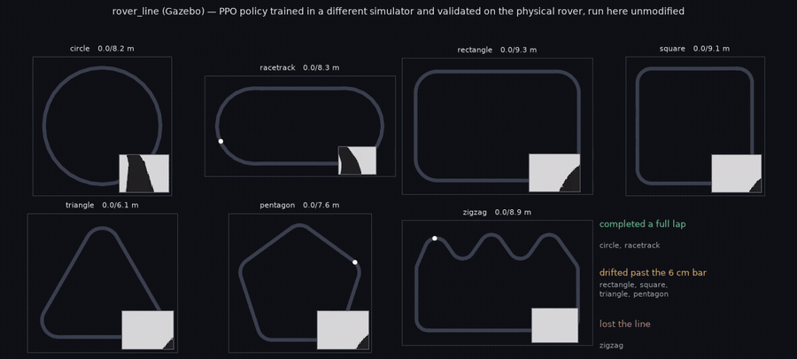

# Rover Line

`rover_line` is the sim-to-real environment: a differential-drive rover follows
a painted line around a closed track, using only sensors the physical machine
actually carries, and commanding only what its firmware actually accepts. It
exists to answer one question — does a policy trained in Gazebo drive the real
rover? — so every choice below is pinned to a measurement of the hardware
rather than to what is convenient in simulation.

It is a **separate spec from [`line_follower`](line_follower.md)**, which is
left untouched along with all of its recorded results. Where the two differ,
this page says why.

## The physical rover

Every constant in the spec traces to one of these.

| Quantity | Value | Source |
|---|---|---|
| Wheel radius | 0.035 m | `rover_bare/model.sdf` |
| Wheel separation | 0.099 m | measured between wheel link poses |
| Camera height | 0.1388 m | measured in-sim; real rover is 0.14 m |
| Camera pitch | 45° down | `camera_link` pose |
| Camera sensor | OV2640, 4:3, 68° diagonal | XIAO ESP32S3, `wmala2/rover_camera_firmware` |
| Ground visible | 0.059 m → 0.328 m ahead | derived from the three rows above |
| Command interface | left/right m/s, 10 Hz | drive firmware `'m'` command |
| Usable speed band | 0.10 – 0.51 m/s | PWM stiction floor → caster-pop limit |
| Track | 3×2 m loop, 0.4 m corners, **lap ≈ 9.31 m** | `scripts/generate_line_track.py` |

The control rate is **10 Hz** (`frame_skip=10` × the 10 ms physics step), which
is the firmware's own command playback rate, so one policy step is exactly one
real command rather than one the hardware would never resolve as a distinct
setpoint.

## Observation: features, not pixels

The policy sees **eleven floats**, all in `[-1, 1]`, and every one is something
the physical rover can produce:

| Slice | Source | What it is |
|---|---|---|
| `0:3` | camera | Near band (0.85–1.0 of frame height): line centroid x, centroid y, visible |
| `3:6` | camera | Middle band (0.55–0.85): the same three |
| `6:9` | camera | Far band (0.25–0.55): the same three |
| `9:11` | **encoders** | Left and right wheel speed ÷ `MAX_WHEEL_RAD_S`, quantized to one encoder count |

Three bands rather than one, because a single row gives position only, while
several give position *and* angle — which is what lets a tracker see a corner
coming. Both axes of each centroid are carried: where the line sits vertically
inside a band says how far ahead it is, separating a corner arriving from one
already under the wheels. An unseen band reports zeros with its flag clear,
so "centred" stays distinguishable from "empty".

That is all three of the rover's sensors — the ESP32-S3 camera and one
quadrature encoder per drive wheel — and nothing else. No pose, no heading, no
waypoint index, no track identity reaches the policy. A band also needs at
least `MIN_LINE_PIXELS = 6` dark pixels before it counts as seeing the line:
without that floor a single dark pixel from the caster, a shadow or sensor
noise defines the band's centroid, handing the policy a confident wrong answer
instead of an honest empty flag. Measured on real frames, a genuine band
carries 154–199 dark pixels of 384, so the floor rejects noise with a 25×
margin and cannot suppress a real detection.

The encoder reading is snapped to the sensor's own resolution on both sides:
680 counts per 0.2199 m revolution, sampled once per 0.1 s step. Quantization
is not randomization — it is present on every real reading, so it is applied
unconditionally rather than behind a DR knob.

## Action: forward and steering

`Box(-1, 1, (2,))`, decoded to per-wheel angular velocity:

```
forward  = CRUISE_RAD_S * (a0 + 1)        0 .. 6 rad/s, cruise at a0 = 0
steering = MAX_STEERING_RAD_S * a1        +/- 4 rad/s
left, right = forward - steering, forward + steering
```

Two properties matter, and each replaced an earlier choice that did not
survive contact with the problem.

**The command can stop.** `[-1, 0]` is a halt, and the middle of the range is
cruise. An earlier forward-only map put a floor under every command to stay
above motor stiction, which also made "slow down for this corner"
unrepresentable.

**Steering may reverse a wheel.** At full steering the inner wheel runs
backwards (measured: −0.83 rad/s against +7.30), so the rover can pivot — the
tactic RoboCup Junior names for a 90° corner, which the previous map forbade
outright while offering no replacement.

`AgentSpec.command_limits` caps each joint at `MAX_WHEEL_RAD_S`, applied after
`action_gain_randomization` scales the command, so DR cannot push a wheel past
what the motors deliver.

### The drive sign

Wheel commands are negated (`_DRIVE_SIGN = -1`). The lens is mounted past the
trailing caster and looks along body −Y, while positive joint velocities drive
the chassis along body +Y — so an unnegated command drives the rover *away from
everything it can see*. It follows the line receding behind it, and a corner
only becomes visible once it has been passed.

Re-aiming the camera instead is wrong, and rendering shows why: pointed at +Y
it looks straight over the drive wheels and fills the frame with the rover's
own chassis. Measured world poses at spawn, travelling toward −X:

```
drive wheels x=-0.986 (leading) | base -0.925 | caster -0.817 | lens -0.776
```

The lens sits beyond the caster looking outward, which is where the real
camera is bolted. The mount is right; the sign was wrong. The sign is a
simulator frame convention and is **not** what the firmware sees —
`rover_line_deploy.py` sends un-negated speeds.

## Reward

Dense, and computed from the same sensors the rover carries, so the shaped
part can be evaluated on the laptop during a real run:

```
progress  = clip(mean(measured wheel rad/s) / CRUISE_RAD_S, -2, 1)
alignment = 1 - |near-band centroid x|          (0 when no line is visible)
motion    = progress * (0.25 + 0.75 * alignment)    or -1 when the line is lost
reward    = motion - 0.02 * ||a - a_prev||^2 - 0.01
```

plus **+10** on completing a lap and **−5** on a terminal failure.

Four things are deliberate. Progress is **measured, not commanded**, so a
command the motors did not execute earns nothing. It is **capped at cruise**,
so raw speed cannot substitute for centring. Losing the line pays a flat −1
rather than zero, because zero is what standing still on a visible line pays
and those should not be worth the same. And **jerk is priced rather than
filtered** — charging `0.02 * ||Δa||²` is why this spec runs no
`action_lowpass`: filtering the command needs the filter state in the
observation to stay Markov, whereas a penalty needs the previous action only
inside the reward and leaves the observation alone.

The completion bonus and failure penalty are added by `rover_line.py` rather
than by the shared contract, because only the simulator knows the episode is
over and only it can see the track well enough to say a lap was finished.

## Termination

Outcomes are geometric and temporal, deliberately independent of the shaped
reward: a high return does not establish success.

| Outcome | Condition | Kind |
|---|---|---|
| `completed` | lap progress within `FINISH_TOLERANCE_M` (3 cm) of the loop length | terminated, **+10** |
| `off_track` | chassis more than `MAX_DEVIATION_M` (6 cm) from the centreline | terminated, −5 |
| `tipped` | chassis below `TIPPED_HEIGHT_M` (3 cm) | terminated, −5 |
| `line_lost` | nearest band empty for **half a second** continuously | terminated, −5 |
| `timeout` | 1200 steps (120 s at 10 Hz) | truncated, no penalty |

Line loss is debounced by `AgentSpec.termination_grace_steps`, because a
corner can swing the line out of frame for a frame or two and an episode that
ends there teaches nothing about recovering. Keeping timeout as a truncation
rather than a termination is what lets the value function bootstrap through it.

### Measuring against the track itself

Progress, deviation and completion are judged against the track's own
**centreline**, which is analytic here rather than something to recover from a
mesh: every builder in `line_track_shapes.py` lays the track as boxes end to
end along the path, so chaining each box's own axis reproduces the path
exactly. The rectangle comes out at **9.315 m** against the documented 9.31 m
lap, and every extracted point on all seven shapes lies inside the tape.

Three details that are easy to get wrong, and were:

- Each agent drives its **own copy** of the scenery laid out along x, so world
  coordinates alone project onto a neighbour's track — which read 145 cm of
  deviation before the origin was threaded through.
- Under track-shape randomization the loop **changes between episodes**, so a
  single fixed centreline would silently score against the wrong track; the
  drawn shape rides along with the spawn pose.
- A randomized spawn is tangent-aligned to whichever segment was drawn, so
  about half face against the centreline's arbitrary ordering. Forward is
  decided **per episode** from the rover's own heading at reset; without that,
  those episodes accrue negative progress and could never complete a lap
  however well they drove.

The projection searches a window around where the rover was last rather than
globally, because a closed loop has two arms that pass close at a corner and a
global nearest-point search would jump between them and report a lap finished
in one step.

## Results

> **Every number below the next section is historical.** The Results and
> Zero-shot tables were measured against the previous specification — a
> fourteen-float observation over four half-frame bands, a forward-only action
> map with no stop, a reward with no completion bonus or jerk term, and a
> 600-step cap. Those checkpoints still load but they are not policies for
> this task. They are kept because the *methodology* they record still
> applies, not because the figures do.

### Cross-simulator transfer

The strongest evidence this environment is measuring the right thing did not
come from a policy trained in it. A PPO policy trained in a **different
simulator** (MuJoCo, with its own physics engine, renderer and track assets)
and validated on the **physical rover** was run here unmodified — same
eleven-float observation, same action decode, no retraining, no shim:



*([MP4](../vids/rover_line_multitrack.mp4). Each panel shows one track: the
grey loop is the centreline, the coloured trail is the driven path, and the
inset is the 64×48 frame the policy actually sees.)*

| Track | Outcome | Progress | Worst deviation |
|---|---|---|---|
| circle | **completed** | 8.22 / 8.19 m | 4.2 cm |
| racetrack | **completed** | 8.36 / 8.33 m | 6.0 cm |
| rectangle | off track | 3.07 / 9.32 m | 6.2 cm |
| square | off track | 2.39 / 9.09 m | 6.7 cm |
| triangle | off track | 1.99 / 6.13 m | 6.7 cm |
| pentagon | off track | 1.74 / 7.64 m | 6.6 cm |
| zigzag | line lost | 0.04 / 8.89 m | 2.8 cm |

Two readings, and the second matters more.

**The transfer is real.** Two full laps, driven by a policy that had never
seen this physics engine, this renderer, or these assets. The scene is not
even matched: the frame is 64×48 here against 64×64 there, the camera sits at
`[0, −0.15, 0.05]` against `[0, −0.108, 0.026]`, the tape is 8 cm wide against
5.08 cm, and the circle is an 8.19 m lap against 2.8 m. That the policy still
laps under all of those differences says it is tracking the line rather than
replaying a trajectory, and it says the observation contract — not the
simulator — is what the behaviour depends on.

**The failures are structured, not noisy.** Every shape it completed is
smooth; every shape it failed has hard corners (0.28–0.4 m rounding radius),
and it failed all four the same way, drifting to 6.2–6.7 cm against a 6 cm
bar — marginally, at the corner, rather than losing control. The training
tracks on the other side were a circle, an oval and a figure-eight: all
smooth, none with a corner of this kind. This is a policy meeting a feature of
the world it was never shown, which is exactly the gap a *shape*-randomized
training run in this environment exists to close.

The zigzag result is a different thing again — the line is gone within five
steps, at a spawn point on one of its tight corners, which the shape's own
generator notes were already marginal for this camera.

## Domain randomization

DR here covers two surfaces: the **motors** (what the rover does with a
command) and the **encoder link** (what it reports back). Each agent draws its
own value from the range below at construction and holds it for the rest of
training. The camera surface is deliberately empty — see Measured exclusions.

| Parameter | Range (per agent) | Shipped | Why it is here |
|---|---|---|---|
| `action_gain_randomization` | `U(0.95, 1.05)` per **wheel** | `0.05` | Commanded speed is not achieved speed on real motors. `line_follower`'s docs call this "the dynamics knob that actually bites here", tuned there to this value. Drawn independently per actuator: a shared gain changes how fast the rover goes, a left/right mismatch changes where it ends up |
| `action_noise_randomization` | magnitude `U(0, 0.03)`, then `N(0, magnitude)` added per step | `0.03` | Per-tick motor jitter, distinct from a fixed gain bias. `line_follower` reached 40/40 with 0.03 in isolation and only had to cut it when stacking three new mechanisms at once |
| `battery_discharge_randomization` | depletion `U(0, 0.05)`, resampled per episode, applied as `1 - depletion·t/T` | `0.05` | Actuator authority falls as the pack drains. Halved from `line_follower`'s isolated 0.1 because a 600-step episode at 10 Hz is 60 s, and losing a tenth of authority in one minute is a flat battery, not a sag |
| `encoder_noise_randomization` | scale `U(0.97, 1.03)` per **wheel**, then `×(1 + N(0, 0.03))` per read | `0.03` | Counts become metres through an assumed wheel diameter and counts-per-revolution, and neither is exact. Per-wheel rather than per-robot: a shared error only changes how fast the rover thinks it is going, a left/right mismatch changes where it thinks it is **heading**, and veer is what loses a line. The firmware carries separate `TRIM_LEFT`/`TRIM_RIGHT` for the same reason, which is where the magnitude comes from |
| `encoder_latency_randomization` | lag `U(0, 1.0)` control steps, fractional | `1.0` | A reply describes the wheel as it **was**. Counts accumulate over the interval before the reply, so even a perfect link returns a value centred half a step in the past; the UDP round trip and the camera's capture instant add the rest. One step is the ceiling, so a draw spans "current" to "one command stale" |
| `camera_mount_randomization` | `U(-3, +3)` mm on each camera axis, drawn once per agent | `0.003` | The lens is bolted to a printed mount, so a few millimetres of placement error is the real build variation. Matches the ±3 mm the MuJoCo build of this rover randomizes over |
| `camera_angle_randomization` | `U(-3, +3)` degrees on camera pitch **and** on horizontal FOV, drawn once per agent | `3.0` | Mount tilt and lens unit-to-unit variation. The MuJoCo build randomizes tilt over 42–48° against a 45° nominal and FOV over 57–63° against 60°, i.e. ±3 on each. Population-based rather than per-step, because a mount's tolerance is a fixed property of one robot |
| `encoder_dropout_randomization` | drop probability `U(0, 0.05)` per step | `0.05` | UDP has no retransmission and the ESP32 is also serving camera frames, so replies go missing. 5% is roughly one loss every 2 s at 10 Hz — frequent enough to train against, far short of the sustained silence the deploy client aborts on. A dropped read **holds** the previous value, matching `rover_line_deploy.py`; zeroing would instead claim the rover had stopped dead, a different and much rarer event |

Quantization (~3.2 mm/s) is deliberately **not** in this table: it is present
on every real reading regardless of strength, so it is applied unconditionally
rather than behind a knob. See the observation section above.

### Measured exclusions

Three framework mechanisms are switched off here, each for a reason that was
measured rather than assumed:

| Parameter | Why not |
|---|---|
| `mass_randomization` | This spec is velocity-actuated, and mass is largely masked under velocity control. `line_follower` excludes it for the same reason |
| `visual_randomization` | **Inert on this observation.** At strength 0.15 across 8 agents the feature vector is bit-identical: brightness, pixel noise and JPEG artifacts all leave the dark-pixel mask untouched. It would cost render time and teach nothing |
| `track_color_randomization` | **A cliff, not a gradient.** At 0.04, 0.08 and 0.12 the features are bit-identical; at 0.15 two of eight agents lose the line *entirely* — all four bands empty. A fixed `DARK` threshold has no partially-degraded regime to train against, so this mechanism can only inject unwinnable episodes |

That last row is the important one, but it generalizes only to *photometric*
DR: **no amount of brightness, noise or colour randomization can make this
observation robust to lighting**, because the extractor's answer is binary in
exactly the quantity those perturb. It does **not** generalize to the camera
as a whole — `camera_mount_randomization` and `camera_angle_randomization`
above are geometric, and they move the features continuously, because a
displaced or tilted lens makes the scan bands sample different ground. The camera-side sim-to-real gap
has to be closed by *calibrating* `DARK` against real frames — or by making
the threshold adaptive, at which point randomizing around it would start to
mean something. Until then, the `--dir` path in `rover_line_deploy.py` running
real captures is the only evidence that matters for perception.

**None of these three strengths is tuned.** Each is the right order of
magnitude for the real link, not a value validated against a success bar; tune
them the way `line_follower` tuned its own, with an isolated multi-agent
evaluation, before trusting any of them.

Measured behaviour, `n_agents=4`, each mechanism isolated:

| Mechanism | Observed |
|---|---|
| noise | across-agent spread 0.024 in normalized speed; worst within-agent left/right gap 0.059 |
| latency | during spin-up the most-lagged agent reads 0.507 where the least-lagged reads 0.572, converging once speed is steady — exactly where a late reading is and is not distinguishable |
| dropout (probed at 0.6) | 17–21 held reads out of 29, one agent repeating 0.637 for three consecutive steps; **zero** zeroed reads |
| camera geometry | per-agent pitch spans 43.7–47.0° against a 45° nominal (3.25° spread) and the feature vector spreads 0.064 across agents at an identical pose and command — where photometric DR spreads exactly 0.000 |
| motor DR (all three together) | identical full-throttle commands give an across-agent achieved-speed spread of 0.138 and per-agent left/right mismatches up to 0.097 — the veer a line follower has to correct for |

The `A_filtered` checkpoint — trained before quantization or any of this
existed — still runs 16/16 laps at 29.96 m forward with **all three** shipped
strengths switched on (re-measured after latency and dropout were added, not
carried over from the noise-only run). That means none of them is a binding constraint yet; it equally
means none has been shown to **cost** anything, which is what a sweep at
higher strengths is for.

## Two bugs this environment found

**Silently unactuated joints.** `HarnessCore._collect_needed_joints` discovers
which joints a spec drives by probing `action_to_commands` with the *scalars*
`0` and `1`, inside a bare `except Exception: pass`. A hand-written map that
indexes `action[1]` raises `IndexError` on a one-element probe, contributes no
joint names, and every command it later computes is dropped — the rover reports
perfect commands and does not move. Nothing catches it: the exception is
swallowed, and an empty joint set is trivially "all resolved", so the
world-load guard stays quiet. Fixed by asking `spec.actuated_joints` (which
probes with a correctly shaped action) first; `rover_line`'s map also resizes,
matching the convention every mapping in `agent_spec`'s toolkit follows.

**Commanded distance is not distance.** `dr_eval.py --solved-distance` derives
metres from the action map times the timestep. A stationary rover scores
`600 × 0.1 s × 0.30 m/s = 18.0 m`, which is what it reported. Any bar built on
it can be passed without moving.

## Deploying to hardware

`results/for_rover_repo/rover_line_deploy.py` takes camera frames and prints
(or sends) left/right wheel speeds. It is standalone — no simulator import — so
it runs on the deployment laptop with numpy, opencv and SB3.

Run the self-check first, every time the spec changes:

```
python rover_line_deploy.py --self-check
```

It imports the environment's own extractor and asserts the two agree bit for
bit on 200 randomised frames, including the termination condition, plus the
action filter's `ALPHA`, the observation width, and the encoder quantum. If
that fails, every action it prints is wrong in a way that still looks
plausible.

### One contract, two homes

`envs/rover_line_contract.py` is the single definition of what a policy sees
and what it commands: the band extractor, the encoder normalisation and
quantisation, the action-to-wheel-speed map, the termination test and the
shaped reward, plus `SCHEMA_VERSION`/`MODEL_API` so a runtime that knows an
older layout refuses a newer policy instead of mis-slicing its floats.

It has exactly two homes — this repository, and the rover repository beside
the runtime that imports it. `results/for_rover_repo/` deliberately keeps only
the runtime: a third copy would be a third thing to keep in step, and a
divergent extractor does not fail at the boundary, it fails on hardware in a
way that still looks plausible. `test_rover_line.py` enforces that by failing
if the runtime ever re-inlines the extractor or a second contract file
reappears, and `results/for_rover_repo/README.md` has the copy step.

The check that matters is behavioural, not textual. Run on a machine that can
import the simulator package:

```
python rover_line_deploy.py --self-check
```

diffs the deployed extractor, termination test and action map against the
simulator's own on 200 randomised frames and asserts the schema versions
match. That is stronger than comparing bytes, because it is what actually has
to hold.

Nothing simulator-specific belongs in the contract. The drive-sign negation is
a Gazebo frame convention, not a property of the rover, so it stays in
`rover_line.py`, which converts simulated joint velocities into the units the
real encoders report.

### The encoder link is not optional

`RoverClient` speaks the firmware's UDP protocol — commands to port 9000,
replies on 9001 — and implements the three things this loop needs: `'m'` to
set closed-loop wheel speeds in m/s, `'e'` to read cumulative counts, and a
stop that commands the floor speed and then zero PWM (the forward-only action
space has no stop in it). Counts are cumulative, so speed is a difference
between consecutive replies over the wall-clock interval between them.

```
python rover_line_deploy.py model.zip --url http://<cam-ip>/capture --host <rover-ip>
python rover_line_deploy.py model.zip --url http://<cam-ip>/capture --host <rover-ip> --send
```

Without `--host` the encoder channels read zero, and that is a **dry run
only**: the policy was trained with live encoders in both its observation and
its reward, so feeding it zeros is not a degraded mode, it is a different
input distribution. The script says so on startup rather than failing
silently, and `--send` without `--host` is refused outright.

A failed read holds the **last good value** rather than substituting zero,
which would tell the policy the rover had stopped dead; after five consecutive
failures the run stops, on the grounds that driving on a frozen wheel-speed
reading is worse than not driving. Nothing in simulation currently reproduces
either the holding or the latency that makes it necessary — see Domain
randomization above.

### Calibration checklist, for when the rover is in hand

Untested assumptions, each one a place sim and reality can diverge:

1. **Drive sign on hardware.** The simulator negates wheel commands for its own
   frame convention; the deploy script sends un-negated speeds. Confirm a
   positive `left_mps`/`right_mps` drives the real rover caster-first, toward
   the camera. If it does not, negate in the deploy script, not in the spec.
2. **Camera frame rate.** The model renders at 15 Hz to match `STREAM_FPS`, but
   control runs at 10 Hz, so roughly 1.5 frames arrive per step; on hardware,
   JPEG encode and WiFi add latency the simulator does not model. Measure the
   real frame-to-action delay before trusting the transfer.
3. **`DARK = 60`.** The threshold that defines "line" was set against the
   simulator's renderer. Capture real frames of the real tape under the real
   lighting and check the histogram separates.
4. **Stiction floor.** `V_MIN = 0.10 m/s` comes from the firmware's PWM floor,
   not from a measurement of a loaded wheel on a real surface. Find the speed
   at which the wheels actually start turning on the floor you will run on.
5. **Track geometry.** The sim track is a 3×2 m loop with 0.4 m corners. Build
   the physical track to match, or regenerate the sim track to match what you
   built — the 0.4 m radius is what makes the corners reachable.

## Known gaps

- No domain randomization yet, deliberately: DR strengths are tuned against a
  success bar, and this task has to clear its bar once before any strength
  means anything. `line_follower`'s DR mechanisms all apply here when it does.
- `curvature` (feature 9) measured ±0.06 through a full corner approach and
  carries little signal as defined; the informative corner cue is the far band
  emptying. It is retained because the network can ignore it, but it is a
  candidate for removal.
- Wheel encoders are not in the observation. The real rover has them, and
  commanded speed is not achieved speed during the motor's ramp.
