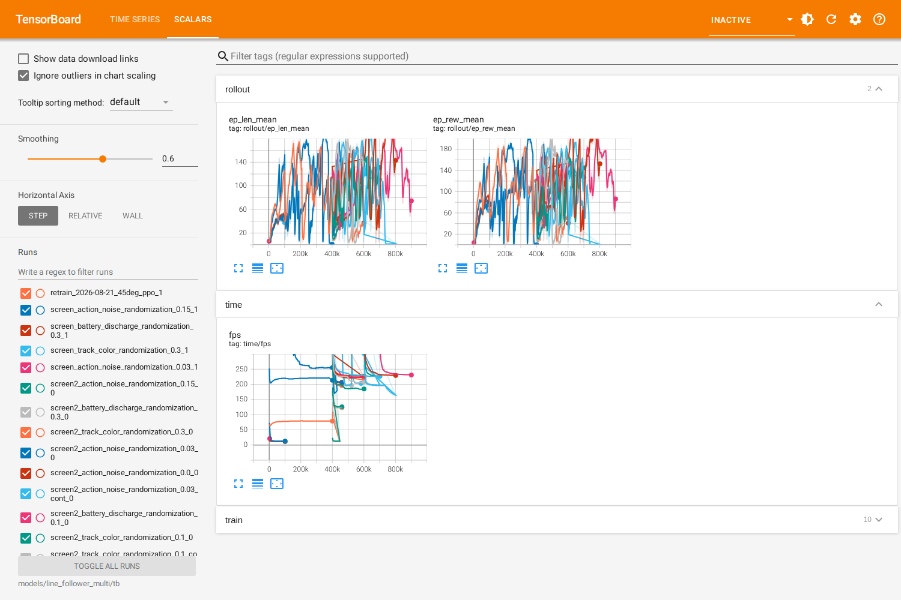
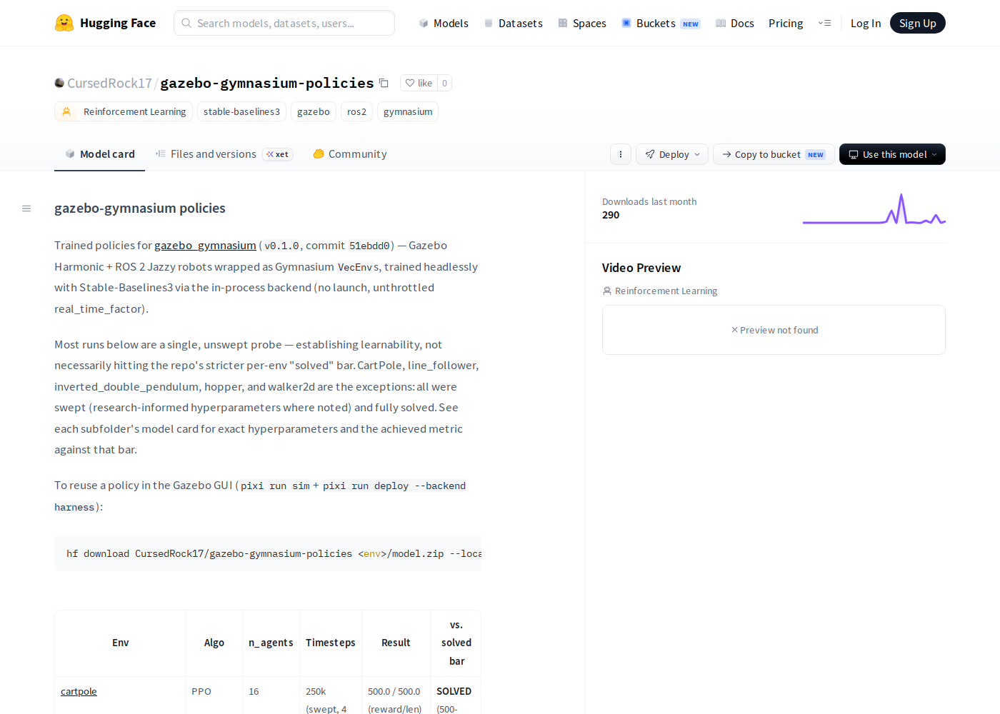
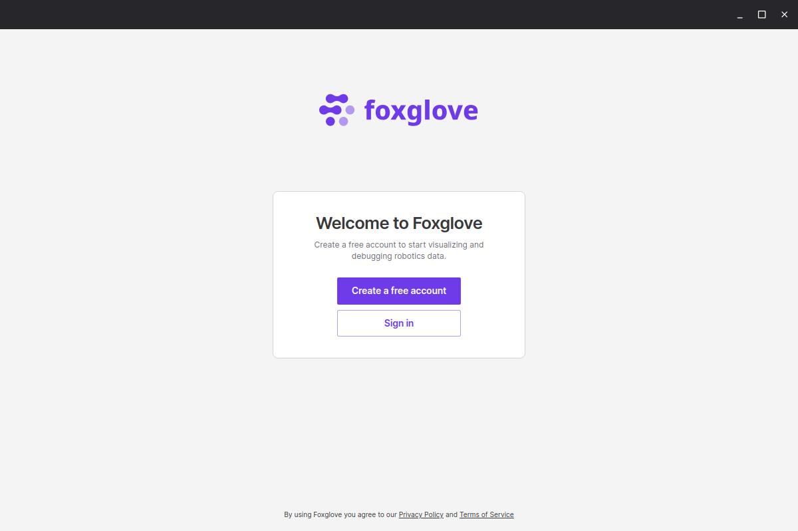
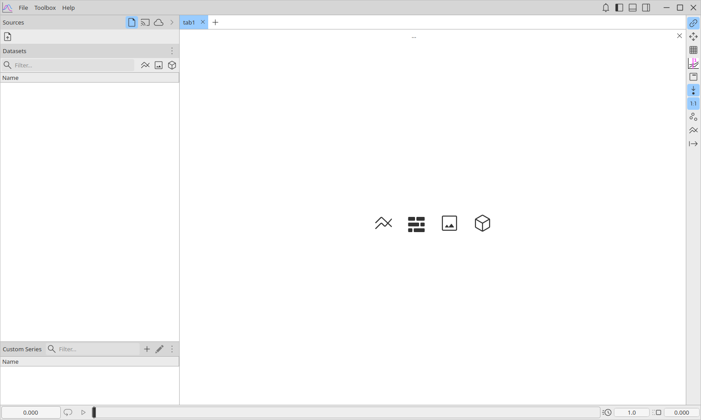

# Reviewing Training Data

A training run produces three different things worth looking at
afterward: the scalar curves SB3 already logged, the checkpoint itself
once it is worth sharing, and the raw signals a live simulation is
producing right now. TensorBoard, the Hugging Face Hub, and a
gz-transport-based tool such as Foxglove or PlotJuggler cover those three
cases respectively, and this page walks through each.

## TensorBoard

`train.py --tensorboard` logs to `models/<agent>_multi/tb/`, one run
subdirectory per invocation, without needing any extra setup: the
TensorBoard writer comes from Stable-Baselines3 itself.

```bash
pixi run train --agent line_follower --n_agents 4 --timesteps 400000 --tensorboard
```

Point TensorBoard at that directory and open the printed URL.

```bash
pixi run bash -c "source install/setup.sh && tensorboard --logdir models/line_follower_multi/tb"
```



Filtering by regex in the "Runs" sidebar helps once a directory
accumulates many runs, which happens quickly during sweep-style tuning
work like `line_follower`'s (see
[its Domain Randomization section](examples/line_follower.md#domain-randomization)
for what that tuning history actually looked like). `--wandb` mirrors the
same scalars to Weights & Biases alongside TensorBoard, for teams that
prefer a hosted dashboard; see the flag's own description in each
example's Training Arguments table.

## Hugging Face Hub

Published checkpoints live at
[`CursedRock17/gazebo-gymnasium-policies`](https://huggingface.co/CursedRock17/gazebo-gymnasium-policies),
one subfolder per environment, each with its own model card carrying the
real hyperparameters and evaluated result. `train.py --push-to-hub
<repo_id>` uploads a checkpoint plus an auto-generated model card after
training finishes; `deploy.py --from-hub <repo_id> --hub-filename
<env>/model.zip` downloads and runs one without a separate step. Every
per-environment doc under [`examples/`](examples/README.md) documents its
own exact command in a "Deploying Published Models" section.



Outside this repository's own scripts, `huggingface_sb3` loads a
checkpoint directly:

```python
from huggingface_sb3 import load_from_hub

checkpoint = load_from_hub(
    repo_id="CursedRock17/gazebo-gymnasium-policies",
    filename="hopper/model.zip",
)
```

or the Hub CLI downloads it as a plain file:

```bash
hf download CursedRock17/gazebo-gymnasium-policies hopper/model.zip --local-dir models/
```

`huggingface_hub` (the lower-level package both of the above build on)
stays outside pixi's dependency list, the same optional treatment Weights
& Biases gets elsewhere in this project, so a one-time `pip install
huggingface_hub` (or `huggingface_sb3`) is needed first.

## Foxglove And PlotJuggler, Through GZ Topics

Watching a *live* simulation is a different problem from reading a
finished log: it means subscribing to Gazebo Transport (gz-transport)
directly, the same transport `gz topic -e -t <topic>` echoes on the
command line, rather than anything ROS-specific. Neither Foxglove nor
PlotJuggler speaks gz-transport natively, and a topic like
`/rl/observations` carries no schema anyway, just a flat
`gz.msgs.Float_V` array of floats, so there is nothing for either tool to
introspect even if it could connect. What both tools do speak is the
[Foxglove WebSocket protocol](https://github.com/foxglove/ws-protocol),
and PlotJuggler ships a "Foxglove Bridge" streaming plugin for exactly
this.

[`scripts/gz_topic_to_foxglove.py`](../scripts/gz_topic_to_foxglove.py)
bridges the two: it subscribes to a `Float_V` topic with the real
`gz.transport` Python bindings, labels each value using `--n-agents` and
`--fields`, and republishes every message as JSON, live over a Foxglove
WebSocket server and (with `--csv`) appended to a CSV file.

```bash
python scripts/gz_topic_to_foxglove.py \
    --topic /rl/observations --n-agents 4 \
    --fields cart_pos,cart_vel,pole_angle,pole_ang_vel \
    --csv /tmp/cartpole_observations.csv
```

Run it alongside a launched simulation (`ros2 launch
gazebo_gymnasium_bringup cartpole_harness.launch.py n_agents:=4` in one
terminal, the bridge in a second, `pixi run deploy --agent cartpole
--backend harness` in a third to actually drive it) and it needs
`foxglove-websocket` (`python3 -m pip install foxglove-websocket`), kept
out of the pixi environment since this is a docs and debugging aid, not
part of the trained pipeline. Point it at any other `Float_V` topic, or
any other environment's field names, and the same script works
unchanged.

### Foxglove

Foxglove's desktop app and its web app at `app.foxglove.dev` both require
a free account now (a device-code sign-in flow), a real product
constraint worth knowing before reaching for it, not a bug in the bridge
above.



Once signed in, "Open connection" → "Foxglove WebSocket" →
`ws://localhost:8765` connects live, and a Plot panel with
`agent0_pole_angle` (and so on) as its path plots the same values the
bridge script above is republishing, as they happen.

### PlotJuggler

PlotJuggler needs no account. Its bundled "Foxglove Bridge" streaming
source connects to the exact same `ws://localhost:8765` server the
bridge script opens, live, with no Foxglove account and no extra
protocol work: the plugin exists specifically because Foxglove's
WebSocket protocol became a de facto standard other tools adopted.
Loading the `--csv` file instead, through PlotJuggler's plain CSV data
source, works just as well for a finished run rather than a live one.



## A ROS 2 Alternative

Every environment already carries a `ros-jazzy-ros-gz` dependency
(`ros_gz_bridge`, `ros_gz_sim`), so bridging a gz-transport topic to a
plain ROS 2 topic instead of running the script above is also an option,
useful for teams already standardized on ROS-native tooling (`rqt_plot`,
`ros2 topic echo`, RViz, or PlotJuggler's own `ros2-topic-subscriber`
plugin, which needs a real ROS 2 install on `$PATH` to load rather than
this repository's pixi-bundled one). `ros_gz_bridge` needs an explicit
message-type mapping per topic, and `gz.msgs.Float_V` has no standard ROS
2 equivalent, so a custom message (or a small relay node reusing the same
`gz.transport` subscription this page's script does) is the practical
path if that route is preferred.

## Glossary

| Term | Definition |
|---|---|
| **gz-transport** | Gazebo's own pub/sub transport; the wire protocol every `gz topic` command and this repository's harness plugin use |
| **Foxglove WebSocket protocol** | The live-streaming protocol Foxglove originated and PlotJuggler also implements, independent of ROS |
| **Hugging Face (HF) Hub** | The model-hosting platform this project publishes trained checkpoints to |
| **AgentSpec** | The dataclass describing one agent's model, observation, action, reward, and DR configuration |
