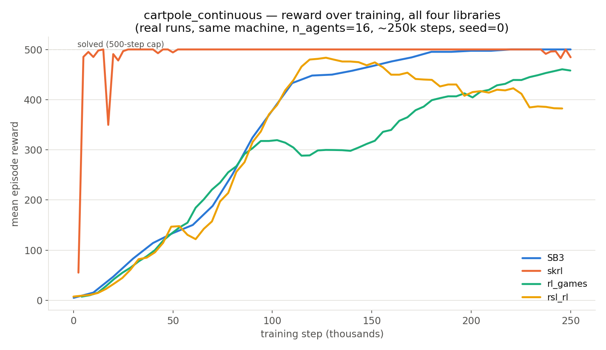
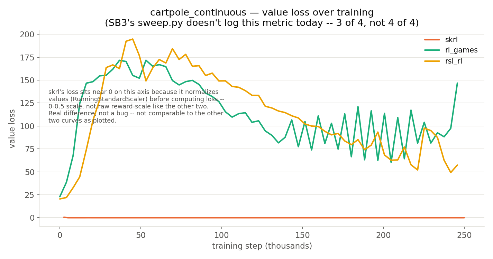
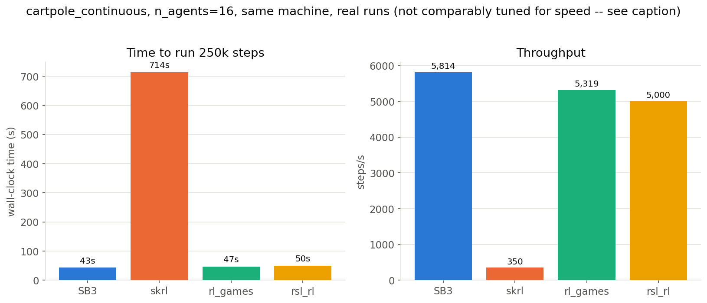

# RL Libraries

Isaac Lab's own advertised reinforcement-learning library support covers
skrl, rsl_rl, rl_games, and Stable-Baselines3. This page shows the "how"
for the same four against `gazebo_gymnasium`: what each library actually
accepts as an observation or action space, and, now with real, tested
code rather than sketches, what it takes to actually train one on this
repository's engine. See
[`docs/comparison.md`](comparison.md#rl-library-integration) for the
original feasibility research this grew out of.

All four are real and tested now, each trained end to end on
`cartpole_continuous` against the real `make_inprocess` engine, same
machine, same seed, roughly the same 250,000-step budget:
`training_scripts/train_skrl.py`, `train_rl_games.py`, and
`train_rsl_rl.py` (Stable-Baselines3 already had `train.py` and
`sweep.py`). All four need the `rl-libs` pixi environment
(`pixi run -e rl-libs bash -c "source install/setup.sh && python
training_scripts/train_X.py"`), kept out of the default environment
deliberately; `pixi.toml`'s own comment explains why.

All three new scripts take `--agent <name>` just like `train.py` and
`sweep.py` do, with `cartpole_continuous` serving only as the default, not
a hardcoded target. Any registered Box-action agent, `hopper`, `walker2d`,
`half_cheetah`, `reacher`, and `ant` among them, works, and each script
validates the specification up front, exiting with a clear error for
Discrete actions or image observations, which none of the three models
here support, detailed in the Supported Spaces table below.

## Supported Spaces

| Library | Observation Spaces | Action Spaces |
|---|---|---|
| [Stable-Baselines3](https://stable-baselines3.readthedocs.io/en/master/) | `Box`, `Discrete`, `MultiDiscrete`, `MultiBinary`, single-level `Dict` (`MultiInputPolicy`) | `Box`, `Discrete`, `MultiDiscrete`, `MultiBinary`, algorithm-dependent (PPO and A2C: all four; SAC, TD3, and DDPG: `Box` only; DQN: `Discrete` only) |
| [skrl](https://skrl.readthedocs.io/en/latest/) | `Box`, `Discrete`, `Dict`, wrapping the environment's native Gymnasium space directly, with no conversion needed | `Box` (Gaussian or deterministic models), `Discrete`/`MultiDiscrete` (Categorical or Multi-Categorical models), model-dependent, the same shape as SB3 |
| [rl_games](https://github.com/Denys88/rl_games) | `Box` (default), `Dict` (asymmetric actor-critic, a separate `obs`/`states` pair for the critic) | `Box` (`continuous_a2c`/`continuous_a2c_logstd`), `Discrete` (`a2c_discrete`), `MultiDiscrete` (`a2c_multi_discrete`) |
| [rsl_rl](https://github.com/leggedrobotics/rsl_rl) | `Box` only, flat tensors grouped by role (`policy`/`critic`/others) through `TensorDict`, with no native `Dict` or image support | `Box` only, since `ActorCritic` builds on a Gaussian head and no `Discrete`/`Categorical` head exists upstream |

Every `gazebo_gymnasium` specification today runs `Box`/`Discrete` state
observations or a single raw-pixel `Box`, the `line_follower` camera,
disqualifying none of the libraries above from anything this repository
currently ships. `cartpole_continuous`, with its `Box(1,)` action, was
picked as the one common target for all four here specifically because it
is the only space rsl_rl can touch at all.

## Real Training Results

All four ran real training, on `cartpole_continuous`, `n_agents=16`,
seed 0, roughly 250,000 steps, this machine.

| Library | Final Mean Reward (of 500) | Solved? |
|---|---:|---|
| SB3 | 500.0 | Yes, swept, 4 of 4 perfect trials, see `docs/examples/cartpole.md` |
| skrl | 484.4 | Close, converging almost immediately (roughly 5,000 steps) then oscillating between 350 and 500 for the rest of the run |
| rl_games | 458.0 | Close, still climbing at the end of the budget |
| rsl_rl | 382.3 | Real progress, not yet solved at this budget |

### Reward



skrl's curve is the most interesting one, reaching near-500 reward faster
than any of the other three, by roughly 5,000 steps against roughly
150,000 to 200,000 for the others, but never fully stabilizing there,
genuine training noise rather than a fluke of one lucky evaluation,
visible directly in the curve's own oscillation. None of the three
non-SB3 runs were swept the way SB3's winning configuration was, detailed
in `docs/examples/cartpole.md`; this is each library's first honest
attempt with reasonable, not exhaustively tuned, hyperparameters. A real
sweep would very plausibly close some or all of this gap between 500 and
the 382-to-484 range; it is a fair, same-shot comparison, not a
claim that these libraries are inherently weaker on this task.

### Value Loss



SB3's own `sweep.py` does not log value loss today, a real, separate gap
covered in `ROADMAP.md`, so this chart shows three of the four. skrl's
loss sits near zero on this axis for a real reason explained on the chart
itself: it normalizes values (`RunningStandardScaler`) before computing
loss, so its numbers land on a fundamentally different scale (0 to 0.5)
from rl_games and rsl_rl's raw-reward-scale loss (0 to 200), plotted
together for reference rather than as an apples-to-apples comparison.

### Wall-Clock Time



SB3, rl_games, and rsl_rl land within a tight band, 43 to 50 seconds for
250,000 steps. skrl took 714 seconds, roughly 15 times longer, on the
exact same task, same machine, same step count. That gap is real and
measured, not a typo: this project's default hyperparameters were not
tuned for throughput on any of the four, but a gap this large, not 20 to
30 percent but 15 times, says more about per-step Python and logging
overhead in skrl's `SequentialTrainer` and `RunningStandardScaler`
combination than about the GPU or the environment underneath it, worth a
closer look before drawing a firm conclusion rather than asserted here as
a permanent skrl characteristic.

## Stable-Baselines3

This library already carries the real integration, since every script in
`training_scripts/` builds on it. The three sections below follow the
pattern this one already set.

```python
from gazebo_gymnasium_bridge.envs import make_inprocess
import stable_baselines3 as sb3

env = make_inprocess("cartpole", n_agents=8)   # any registered agent, already an SB3 VecEnv
model = sb3.PPO("MlpPolicy", env, verbose=1)
model.learn(total_timesteps=200_000)
```

## skrl

No adapter code was needed, confirmed by actually training on it: the
native `gymnasium.vector.VectorEnv` entry point (`gym.make_vec(...)`) is
exactly what skrl's `wrap_env()` auto-detects, since it walks the class
hierarchy for a `gymnasium.*` base. The full script lives at
`training_scripts/train_skrl.py`.

The real gotcha here surfaced by training NaN actions into existence:
`RandomMemory(memory_size=...)` must exactly equal `PPO_CFG().rollouts`. A
mismatch, copied from skrl's own reference example without also updating
the memory size to match a smaller rollout count, makes PPO start a
rollout update before the underlying buffer actually fills, reading
uninitialized memory and producing NaN actions, silently dropped by
gz-sim ("Invalid joint force value [nan]... ignored") rather than
crashing outright, which is what made it non-obvious. It reproduced and
confirmed on plain `Pendulum-v1` too, with zero gazebo_gymnasium code
involved, a skrl and configuration footgun rather than an artifact of
this integration.

```python
import gymnasium as gym
from skrl.envs.wrappers.torch import wrap_env
from skrl.agents.torch.ppo import PPO, PPO_CFG
from skrl.memories.torch import RandomMemory

env = gym.make_vec("GazeboCartPoleContinuous-v0", num_envs=16)  # this repo's own VectorEnv
env = wrap_env(env)                                              # auto-detected, no adapter

ROLLOUTS = 256
memory = RandomMemory(memory_size=ROLLOUTS, num_envs=env.num_envs, device=env.device)  # must match
cfg = PPO_CFG()
cfg.rollouts = ROLLOUTS
# Models and remaining configuration continue in training_scripts/train_skrl.py.
```

## rl_games

A small, now-real adapter was needed
(`training_scripts/train_rl_games.py`), since its default registration
path assumes it owns parallelism, spawning N separate single-agent
environment instances itself, which would launch N separate Gazebo worlds
instead of using the N-agents-in-one-world engine. The fix is a custom
`IVecEnv` registered through `vecenv.register()`, the same mechanism Isaac
Lab's own `RlGamesVecEnvWrapper` uses.

Three real gotchas surfaced from running it, not from reading about it.

1. **Observations must be dict-wrapped as `{"obs": array}`**, even without
   an asymmetric actor-critic setup, since `self.obs['obs']` gets accessed
   unconditionally inside rl_games' own rollout loop.
2. **Space objects must be legacy `gym.spaces`, not `gymnasium.spaces`.**
   rl_games checks `type(x) is gym.spaces.Box`, an exact type check
   against the old, unmaintained `gym` package specifically, so a
   structurally identical `gymnasium.spaces.Box` silently fails it and
   nothing gets allocated (`tensor_dict['obses']` stays `None`).
3. **`num_actors` means how many independent episode-boundary groups
   exist, not how many agents exist.** rl_games' own episode-completion
   tracking runs `dones.view(num_actors, num_agents).all(dim=1)`, counting
   an episode only once every agent within one actor group finishes on
   the same step. Since gazebo_gymnasium's agents reset independently,
   setting `num_actors=1, num_agents=16` meant that `.all()` across 16
   asynchronously resetting cartpoles essentially never fired, so a full
   250,000-step run logged zero completed episodes (`rew-inf` in every
   checkpoint name). The fix sets `num_actors=n_agents` and
   `get_number_of_agents() -> 1`, one gazebo_gymnasium agent per rl_games
   "actor."

```python
import gym as legacy_gym  # the conversion gotcha #2 needs
from rl_games.common import env_configurations, vecenv
from rl_games.common.ivecenv import IVecEnv
from gazebo_gymnasium_bridge.envs import make_inprocess


def _to_legacy_space(space):
    return legacy_gym.spaces.Box(low=space.low, high=space.high, dtype=space.dtype)


class GazeboRlGamesVecEnv(IVecEnv):
    def __init__(self, config_name, num_actors, agent="cartpole_continuous", **kwargs):
        self.env = make_inprocess(agent, n_agents=num_actors)  # num_actors IS n_agents

    def step(self, actions):
        obs, rewards, dones, infos = self.env.step(actions)
        return {"obs": obs}, rewards, dones, {}                # dict-wrapped, see gotcha #1

    def reset(self):
        return {"obs": self.env.reset()}

    def get_number_of_agents(self):
        return 1                                                # see gotcha #3

    def get_env_info(self):
        return {"observation_space": _to_legacy_space(self.env.observation_space),
               "action_space": _to_legacy_space(self.env.action_space), "agents": 1}


vecenv.register("GAZEBO_GYMNASIUM",
                lambda config_name, num_actors, **kw:
                GazeboRlGamesVecEnv(config_name, num_actors, **kw))
env_configurations.register("gazebo_gymnasium_env",
                            {"vecenv_type": "GAZEBO_GYMNASIUM",
                             "env_creator": lambda **kw: None})
# num_actors in the runner config equals n_agents; env_config = {"agent": ...}
# flows through to GazeboRlGamesVecEnv's agent kwarg above, so any registered
# Box-action agent works, not just cartpole_continuous. See
# training_scripts/train_rl_games.py.
```

## rsl_rl

Real work went into this one, not a thin wrapper, confirmed by actually
building it (`training_scripts/train_rsl_rl.py`): its `VecEnv` interface
expects PyTorch tensors, not numpy, grouped into a `TensorDict`,
device-resident, plus bookkeeping this project does not track in that
exact form, `episode_length_buf` and a `time_outs`-versus-`terminated`
split in `extras` among them.

The real gotcha here: an actor `MLPModel` with no `distribution_cfg`
builds no stochastic head at all. `self.distribution` stays `None`, and
PPO's `act()` crashes the first time it calls
`self.actor.get_output_log_prob(...)` (`'NoneType' object has no
attribute 'log_prob'`), since `forward()` has nothing to sample from. An
explicit `distribution_cfg={"class_name": GaussianDistribution, ...}` on
the actor, not the critic, which carries no distribution at all, fixes
it.

```python
import torch
from rsl_rl.env import VecEnv
from rsl_rl.modules.distribution import GaussianDistribution
from rsl_rl.models import MLPModel
from tensordict import TensorDict
from gazebo_gymnasium_bridge.envs import make_inprocess


class GazeboRslRlVecEnv(VecEnv):
    def __init__(self, agent, n_agents, device):
        self.env = make_inprocess(agent, n_agents=n_agents)  # Box actions only
        self.num_envs = n_agents
        self.num_actions = int(self.env.action_space.shape[0])
        self.max_episode_length = self.env._spec.max_episode_steps
        self.episode_length_buf = torch.zeros(n_agents, dtype=torch.long, device=device)
        self.device = device
        self.cfg = {}

    def get_observations(self) -> TensorDict:
        obs = torch.as_tensor(self.env.reset(), dtype=torch.float32, device=self.device)
        return TensorDict({"policy": obs}, batch_size=[self.num_envs])

    def step(self, actions: torch.Tensor):
        obs, rewards, dones, infos = self.env.step(actions.cpu().numpy())
        # Extras (time_outs from infos, "log": {}) get built here; see the real file.
        ...

# The actor needs an explicit distribution head, the gotcha noted above.
actor_cfg = {"class_name": MLPModel, "hidden_dims": (64, 64), "activation": "relu",
            "distribution_cfg": {"class_name": GaussianDistribution, "init_std": 1.0}}
```

## Bringing Your Own Algorithm

None of the four libraries above are required at all. Every registered
specification already exposes three plain interfaces, and a hand-rolled
algorithm only needs to consume one of them; nothing about
`gazebo_gymnasium` itself changes.

```python
# 1. The SB3 VecEnv convention: reset() returns obs, step() returns a 4-tuple.
from gazebo_gymnasium_bridge.envs import make_inprocess

vec_env = make_inprocess("cartpole_continuous", n_agents=16)
obs = vec_env.reset()
for _ in range(200_000):
    action = my_policy(obs)                        # anything shaped like action_space
    obs, reward, done, info = vec_env.step(action)
    my_algorithm.update(obs, reward, done, info)    # your own update rule, not SB3's

# 2. Plain Gymnasium: reset() returns (obs, info), step() returns a 5-tuple.
import gazebo_gymnasium_bridge
import gymnasium as gym

env = gym.make("GazeboCartPoleContinuous-v0")
obs, info = env.reset()
for _ in range(200_000):
    action = my_policy(obs)
    obs, reward, terminated, truncated, info = env.step(action)
    if terminated or truncated:
        obs, info = env.reset()
```

That is the whole contract. `docs/examples/cartpole.md`'s "Bringing Your
Own Trainer" section shows the same three surfaces (SB3 VecEnv, any
Gymnasium-speaking tool, the native `gymnasium.vector.VectorEnv`) with
RLlib, CleanRL, Tianshou, and TorchRL as the named examples; a fully
custom loop is just the same surfaces with no library underneath at all.

**OpenAI's own [`baselines`](https://github.com/openai/baselines)
repository** deserves a direct answer, since it is the actual ancestor
of Stable-Baselines and, through it, Stable-Baselines3, already the
primary integration this project uses. Plugging it in directly would
need real work, not a drop-in: its `setup.py` pins `gym>=0.15.4, <0.16.0`,
the pre-Gymnasium `gym` package from years before the Farama fork, and a
TensorFlow build (`tensorflow`/`tensorflow-gpu`/`tf-nightly`, checked
directly in that file), not PyTorch. Its `step()` returns the old
4-tuple, `(obs, reward, done, info)`, not Gymnasium's 5-tuple with
`terminated`/`truncated` split apart. Its GitHub repository shows no
push since mid-2024. Wiring it up would need the exact same fix this
project's own rl_games integration already needed, legacy `gym.spaces`
instead of `gymnasium.spaces`, on top of a shim collapsing
`terminated`/`truncated` back into one `done` boolean. Nobody has built
that adapter here, since Stable-Baselines3 already carries the same
algorithms (PPO, A2C, DDPG) forward as an actively maintained, native
PyTorch integration, the practical path to "OpenAI Baselines style"
training on this repository today.
